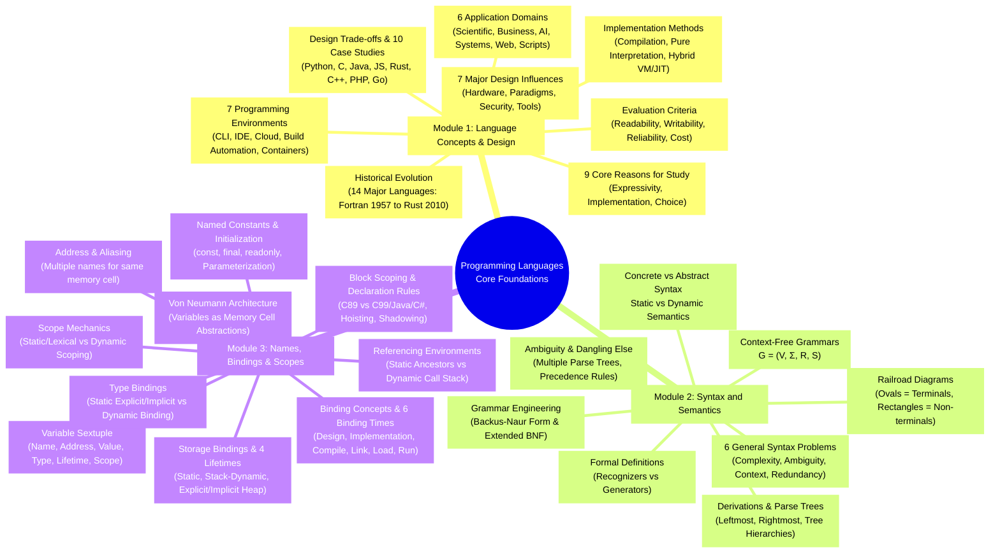
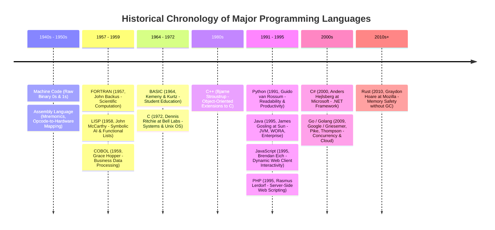

# Programming Languages Prelim Master Reviewer & Forensic Walkthrough
### Academic Modules 1, 2, and 3

---

## 1. The Mental Anchor (Feynman Technique)

> [!INFO] Concepts in a Nutshell
> **Programming Languages as Layered Abstractions**:
> At the silicon layer, a computer is merely a vast array of bistable memory cells governed by a CPU executing raw binary instructions (the Von Neumann architecture). Writing machine instructions directly ($0\text{s}$ and $1\text{s}$) is mentally intractable and error-prone for humans. Programming languages exist as **human-engineered abstraction layers** that bridge the cognitive gap between human problem-solving and physical machine execution.
>
> 1. **The Structural Blueprint (Syntax vs. Semantics)**:
>    - **Syntax** is the *form*, *spelling*, and *structure* of statements (the grammar). It answers: *Is this sentence well-formed according to the rules of the language?*
>    - **Semantics** is the *meaning*, *intent*, and *runtime behavior* of those statements. It answers: *What does this sentence actually do when executed?*
>    - A statement can be syntactically flawless yet semantically catastrophic (e.g., $x = 5 / 0$, or attempting to subtract a number from a string). Syntax is specified mathematically using **Context-Free Grammars (CFGs)** and **Backus-Naur Form (BNF)**, which compilers parse into hierarchical **Parse Trees**.
>
> 2. **The Execution Engine (Compilation vs. Interpretation vs. Hybrid)**:
>    - To run code, high-level abstractions must be translated. A **compiler** translates the entire source program into native machine code ahead of time (maximizing raw speed but sacrificing cross-platform portability). A **pure interpreter** decodes and executes statements line-by-line at runtime (maximizing flexibility and rapid debugging but suffering severe performance overhead). A **hybrid system** (like Java or C#) compiles high-level code into intermediate portable bytecode, which is then executed by a **Virtual Machine (VM)** and accelerated via **Just-In-Time (JIT) compilation**.
>
> 3. **The State and Symbol Engine (Names, Bindings, and Scopes)**:
>    - Every variable in an imperative language is an abstraction of memory characterized by a **sextuple of attributes**: $\langle \text{Name}, \text{Address}, \text{Value}, \text{Type}, \text{Lifetime}, \text{Scope} \rangle$.
>    - **Binding** is the fundamental glue that associates an attribute with an entity, and the **Binding Time** (language design, language implementation, compile, link, load, or run time) dictates the safety, efficiency, and flexibility of the language.
>    - **Scope** is *spatial/textual* (where in the program text a variable is visible), whereas **Lifetime** is *temporal* (when during execution memory is allocated to it). In **static (lexical) scoping**, visibility is locked at compile time by the physical nesting of code blocks; in **dynamic scoping**, visibility is resolved at runtime by searching back up the dynamic call stack of active subprograms.

---

## 2. The Knowledge Architecture (Dual Coding)



---

### Comparative Architecture: The Programming Language Evolution Timeline (1940s–2010s+)



---

### Grand Comparison Matrix: Core Evaluation Criteria vs. Software Engineering Attributes

| Evaluation Criterion | Core Definition                                                                                  | Influencing Language Characteristics                                                                          | Primary Engineering Impact                                                                  | Real-World Failure Consequence                                                                             |
| :------------------- | :----------------------------------------------------------------------------------------------- | :------------------------------------------------------------------------------------------------------------ | :------------------------------------------------------------------------------------------ | :--------------------------------------------------------------------------------------------------------- |
| **Readability**      | Ease with which code can be understood and audited by human programmers.                         | Simplicity (minimal feature multiplicity), Orthogonality, explicit syntax, well-defined control statements.   | Lowers maintenance costs; code is read $10\times$ more often than written.                  | Unmaintainable "spaghetti code"; subtle security vulnerabilities hidden in cryptic syntax.                 |
| **Writability**      | Ease with which a programmer can formulate a solution in code.                                   | Support for abstraction, high expressivity (e.g., list comprehensions), clean syntax, operator richness.      | Maximizes initial development velocity and developer productivity.                          | Boilerplate overload; developers spend excessive time writing repetitive structural patterns.              |
| **Reliability**      | Degree to which a program executes strictly according to specifications under all conditions.    | Static type checking, compile-time bounds checking, robust exception handling, restricted aliasing.           | Prevents runtime catastrophes, system outages, and memory safety breaches.                  | Runtime crashes, segmentation faults, undefined behavior, silent financial data corruption.                |
| **Cost**             | Total monetary, cognitive, and computational resource expenditure across the software lifecycle. | Training curve, compiler tooling, debugging/IDE ecosystems, runtime CPU/RAM footprint, long-term maintenance. | Determines the commercial viability and operational expenditure of enterprise systems.      | Bankrupting cloud compute bills; inability to hire or train engineers due to niche, convoluted toolchains. |
| **Portability**      | Ease with which programs can be transferred between hardware architectures/OS environments.      | Standardization, presence of intermediate bytecode/virtual machines (JVM, CLR), minimal hardware bindings.    | Enables single-codebase distribution across heterogeneous server and client clusters.       | Platform lock-in; massive cost to re-architect or compile for disparate architectures.                     |
| **Generality**       | Suitability of a language across a diverse range of application domains.                         | Support for multiple paradigms (OOP, functional, procedural), extensive standard libraries, generic types.    | Allows teams to standardize on a unified tech stack across web, data, and tooling.          | Domain obsolescence; inability to adapt when business problem requirements shift.                          |
| **Well-Definedness** | Precision, completeness, and clarity of the language's formal syntax and semantic definitions.   | Formal grammar specifications (ISO standards, BNF), unambiguous operational/axiomatic semantics.              | Guarantees identical execution semantics across different compliant compilers/interpreters. | Compiler divergence; code running correctly under Compiler A crashes under Compiler B.                     |

---

## 3. Module 1: Introduction to Programming Languages & Design Foundations

### 3.1 Nine Fundamental Motivations for Studying Programming Language Concepts

Studying programming language concepts is not about memorizing syntax across several dialects; it is about cultivating an analytical understanding of how programming constructs map to architectural capabilities and operational costs.

```
┌─────────────────────────────────────────────────────────────────────────────────┐
│              THE 9 PILLARS OF PROGRAMMING LANGUAGE STUDY                        │
├────────────────────────────────┬────────────────────────────────────────────────┤
│ 1. Increased Capacity to Learn │ Adapting to new languages easily by recognized │
│    New Languages               │ underlying conceptual patterns.                │
├────────────────────────────────┼────────────────────────────────────────────────┤
│ 2. Implementation Insights     │ Knowing how features (GC, recursion, stack)    │
│                                │ work to write computationally efficient code.  │
├────────────────────────────────┼────────────────────────────────────────────────┤
│ 3. Informed Language Choice    │ Selecting the exact right tool for a problem   │
│                                │ domain (e.g., Go vs. C vs. Python).            │
├────────────────────────────────┼────────────────────────────────────────────────┤
│ 4. Efficient & Effective Code  │ Leveraging language mechanics (e.g., pass by   │
│                                │ reference, pointer layout) to optimize perf.   │
├────────────────────────────────┼────────────────────────────────────────────────┤
│ 5. Advanced Debugging Skills   │ Diagnosing stack/heap crashes, memory leaks,   │
│                                │ and segmentation faults from the inside out.   │
├────────────────────────────────┼────────────────────────────────────────────────┤
│ 6. Compiler/Interpreter Basis  │ Grasping grammars (BNF/CFG) to build domain-   │
│                                │ specific languages, parsers, and AST engines.  │
├────────────────────────────────┼────────────────────────────────────────────────┤
│ 7. Architectural Software      │ Implementing structural patterns (MVC, DI)     │
│    Design                      │ naturally through language modularity tools.   │
├────────────────────────────────┼────────────────────────────────────────────────┤
│ 8. Paradigm Exposure           │ Mastering functional, logic, and declarative   │
│                                │ models to handle concurrency and state safety. │
├────────────────────────────────┼────────────────────────────────────────────────┤
│ 9. Creativity & Innovation     │ Designing embedded scripting engines (e.g.,    │
│                                │ Lua/Lisp inside games) and custom tooling.     │
└────────────────────────────────┴────────────────────────────────────────────────┘
```

#### Detailed Breakdown & Concrete Applications

1. **Improved Ability to Learn New Languages**:
   - *Core Mechanism*: All modern programming languages are amalgamations of fundamental primitives (activation records, dispatch tables, lexical closures, type systems). When a developer grasps the conceptual foundation of Object-Oriented Programming (OOP) or lexical scope, learning Kotlin after Java, or Go after C, reduces to a trivial exercise in syntax mapping.
   - *Real-World Scenario*: A full-stack engineer transitioning from Express.js (Node.js) to Django (Python) adapts rapidly because HTTP pipelines, request/response lifecycles, and ORM abstractions share identical conceptual mechanics.

2. **Better Understanding of Language Implementation**:
   - *Core Mechanism*: High-level syntax conceals hardware operations. Knowing how garbage collection operates (e.g., mark-and-sweep vs. generational copying vs. reference counting) enables developers to avoid memory allocation bottlenecks and excessive GC pauses.
   - *Real-World Scenario*: Real-time game developers in C# (Unity) intentionally avoid object instantiations inside the `Update()` loop, pre-allocating memory pools to prevent GC-induced frame-rate drops.

3. **Ability to Make Better Language Choices**:
   - *Core Mechanism*: Every language embodies specific design trade-offs. Matching the problem requirements against language characteristics ensures system longevity.
   - *Real-World Scenario*: A FinTech startup architecting a high-throughput, real-time transaction router selects **Go** for its lightweight goroutine concurrency and rapid compilation, while choosing **Python** for the downstream offline credit-risk machine learning pipeline.

4. **Enhanced Ability to Write Efficient and Effective Code**:
   - *Core Mechanism*: Understanding memory layout, data alignment, cache locality, and parameter passing modes (pass-by-value vs. pass-by-reference) allows programmers to craft high-performance code.
   - *Real-World Scenario*: In C++, passing a massive `std::vector<Matrix>` by value forces a deep copy of heap buffers; passing via `const Matrix&` avoids all memory reallocation overhead.

5. **Better Debugging and Problem-Solving Skills**:
   - *Core Mechanism*: Bugs frequently manifest at the boundary between language abstractions and system memory. Understanding the distinction between the runtime stack (activation records) and the heap allows engineers to diagnose stack overflows, dangling pointers, and memory leaks.
   - *Real-World Scenario*: A DevOps engineer troubleshooting an intermittent crash in a multi-threaded service immediately inspects thread stack allocations and shared-pointer race conditions.

6. **Foundation for Compiler and Interpreter Design**:
   - *Core Mechanism*: Parsing structured text is ubiquitous in software engineering—from writing custom query filters to building configurations and linters. Knowledge of Backus-Naur Form (BNF) and Abstract Syntax Trees (AST) is essential.
   - *Real-World Scenario*: Engineers utilizing tools like ANTLR or Lex/Yacc to build Domain-Specific Languages (DSLs) for rule-engine automation in insurance underwriting.

7. **Promotes Better Software Design**:
   - *Core Mechanism*: Language mechanisms enforce or undermine clean architecture. Understanding packages, visibility modifiers, namespaces, and closures dictates how effectively a large software system can be decoupled into cohesive, maintainable modules.
   - *Real-World Scenario*: Structuring an enterprise Java application into clean hexagonal architectural layers utilizing interfaces and dependency injection.

8. **Exposure to Programming Paradigms**:
   - *Core Mechanism*: Working outside the imperative paradigm fundamentally alters problem-solving perspectives. Functional programming enforces immutability and pure functions, eliminating race conditions in parallel computing.
   - *Real-World Scenario*: React developers writing clean UI components leveraging functional paradigms (`map`, `filter`, pure reducer state transitions).

9. **Encourages Creativity and Innovation**:
   - *Core Mechanism*: When existing tools cannot concisely express a domain problem, language-aware engineers invent domain-specific languages or embed scripting runtimes.
   - *Real-World Scenario*: Game engine developers embedding **Lua** inside a C++ game core to empower game designers to write quest logic without recompiling the 50-gigabyte binary.

---

### 3.2 The Six Major Programming Domains

```
┌──────────────────────────────────────────────────────────────────────────────────┐
│                         PROGRAMMING LANGUAGE DOMAINS                             │
├─────────────────────────┬──────────────────────┬─────────────────────────────────┤
│ Domain                  │ Core Demands         │ Dominant Languages              │
├─────────────────────────┼──────────────────────┼─────────────────────────────────┤
│ 1. Scientific           │ Precision, floating- │ FORTRAN, MATLAB,                │
│    Applications         │ point math, matrices │ Python (NumPy/SciPy), Julia     │
├─────────────────────────┼──────────────────────┼─────────────────────────────────┤
│ 2. Business             │ Precise decimal math,│ COBOL, Java, SQL                │
│    Applications         │ record I/O, reporting│                                 │
├─────────────────────────┼──────────────────────┼─────────────────────────────────┤
│ 3. Artificial           │ Symbolic computation,│ LISP, Prolog, Python            │
│    Intelligence         │ logic, ML frameworks │ (PyTorch, TensorFlow)           │
├─────────────────────────┼──────────────────────┼─────────────────────────────────┤
│ 4. Systems              │ Direct hardware/RAM  │ C, C++, Rust                    │
│    Programming          │ control, zero runtime│                                 │
├─────────────────────────┼──────────────────────┼─────────────────────────────────┤
│ 5. Web                  │ Distributed client/  │ HTML/CSS/JavaScript (Frontend), │
│    Development          │ server architectures │ Node.js, PHP, Python, Ruby (BE) │
├─────────────────────────┼──────────────────────┼─────────────────────────────────┤
│ 6. Scripting &          │ Rapid development,   │ Bash, Python, Perl, PowerShell  │
│    Automation           │ OS glue, lightweight │                                 │
└─────────────────────────┴──────────────────────┴─────────────────────────────────┘
```

1. **Scientific Applications**:
   - *Characteristics*: Dominated by dense numerical computations, matrix operations, differential equation solving, and high-precision floating-point arithmetic. Data structures emphasize multi-dimensional arrays and mathematical vectors.
   - *Dominant Languages*: **FORTRAN** (the pioneer, still supreme in supercomputing benchmarks due to aggressive array alias optimization), **MATLAB**, **Python** (accelerated via NumPy C-bindings), and **Julia**.
   - *Exemplar*: NASA simulating rocket aerodynamics and orbital trajectories using FORTRAN clusters; control engineers modeling dynamic feedback loops in MATLAB.

2. **Business Applications**:
   - *Characteristics*: Characterized by extensive file handling, large-scale transaction management, generation of elaborate commercial reports, and strict requirements for fixed-point decimal arithmetic (to eliminate floating-point rounding errors in currency calculations).
   - *Dominant Languages*: **COBOL** (Common Business-Oriented Language, which still processes over 70% of global daily financial transactions), **Java**, and **SQL**.
   - *Exemplar*: Central banking mainframes managing millions of transactions across legacy COBOL ledgers; enterprise payroll platforms running on Java backends linked to relational SQL databases.

3. **Artificial Intelligence (AI)**:
   - *Characteristics*: Emphasizes non-numeric symbolic computation, graph traversal, recursive tree searches, pattern matching, and knowledge representation. In modern paradigms, it encompasses tensor algebra and differentiable computation graphs.
   - *Dominant Languages*: **LISP** (introduced dynamic memory allocation, trees, and linked lists in 1958), **Prolog** (declarative logic programming), and **Python** (the modern standard due to seamless C/CUDA wrappers like PyTorch and TensorFlow).
   - *Exemplar*: Self-driving vehicle vision models trained with Python/TensorFlow to detect road signs; medical diagnostic expert systems powered by Prolog logical inference engines.

4. **Systems Programming**:
   - *Characteristics*: Demands maximum execution speed, deterministic memory management, direct physical memory addressing (pointers), and execution without heavyweight runtime environments or non-deterministic garbage collectors.
   - *Dominant Languages*: **C** (the lingua franca of systems code), **C++**, and **Rust** (modern memory safety without garbage collection).
   - *Exemplar*: Writing low-level USB device drivers in C; developing embedded microcontroller flight-control firmware for drones using C++ or Rust.

5. **Web Development**:
   - *Characteristics*: Centered around client-server network protocols, asynchronous events, document rendering, dynamic user interaction, and RESTful/GraphQL data pipelines.
   - *Dominant Languages*: **JavaScript / TypeScript** (the undisputed browser standard), **HTML/CSS**, paired with backend servers in **PHP**, **Node.js**, **Python**, or **Ruby**.
   - *Exemplar*: Creating complete e-commerce web applications using HTML/CSS for responsive layouts, JavaScript for interactive client shopping carts, and Node.js or PHP for database-backed order fulfillment.

6. **Scripting and Automation**:
   - *Characteristics*: Prioritizes writability, minimal ceremony, dynamic typing, and rapid prototyping over raw execution speed. Used as "glue code" to link disparate programs and automate operating system workflows.
   - *Dominant Languages*: **Python**, **Bash (Shell Scripting)**, and **Perl**.
   - *Exemplar*: System administrators using Bash scripts for scheduled nightly backup rotations; automating web data scraping using Python scripts powered by BeautifulSoup.

---

### 3.3 Language Evaluation Criteria: The Technical Framework

When evaluating a programming language, computer scientists do not rely on popularity; they judge using an interconnected matrix of established criteria:

```
                  ┌─────────────────────────────────────┐
                  │    LANGUAGE EVALUATION CRITERIA     │
                  └──────────────────┬──────────────────┘
            ┌────────────────────────┼────────────────────────┐
            ▼                        ▼                        ▼
     ┌─────────────┐          ┌─────────────┐          ┌─────────────┐
     │ READABILITY │          │ WRITABILITY │          │ RELIABILITY │
     └──────┬──────┘          └──────┬──────┘          └──────┬──────┘
            │                        │                        │
            ├─ Simplicity            ├─ Abstraction           ├─ Type Checking
            ├─ Orthogonality         ├─ Expressivity          ├─ Exception Handling
            ├─ Data Types            ├─ Orthogonality         ├─ Aliasing Restrictions
            └─ Syntax Design         └─ Simplicity            └─ Read/Write Synergy
                                     │
                                     ▼
                              ┌─────────────┐
                              │    COST     │
                              └──────┬──────┘
                                     ├─ Training / Hiring
                                     ├─ Development Velocity
                                     ├─ Compilation & Execution
                                     └─ Long-Term Maintenance
```

#### Detailed Examination of Criteria and Sub-Factors

1. **Readability**:
   - *Overall Simplicity*: A language should have a clean, manageable set of basic constructs.
     > [!DANGER] Trap: Feature Multiplicity
     > **Feature Multiplicity** occurs when there are multiple ways to execute the exact same operation. For example, in Java/C:
     > $$x = x + 1; \quad x += 1; \quad x++; \quad ++x;$$
     > Excessive multiplicity increases cognitive overhead and impairs code auditing.
     >
     > **Operator Overloading** can similarly destroy readability if abused (e.g., overloading the `+` operator to mean "remove elements from a database").
   - *Orthogonality*: A property where a small set of primitive constructs can be combined in a small number of ways, and every combination is valid and consistent.
     - *Lego Analogy*: An orthogonal language behaves like Lego bricks—any piece fits into any other piece smoothly without arbitrary exceptions.
     - *IBM System/360 vs. VAX*: Non-orthogonal instruction sets required distinct operations depending on whether registers or memory cells were accessed.
   - *Data Types*: Adequate facilities for defining data types and structures enhance readability (e.g., having a native `boolean` type instead of using integer `0` and `1`).
   - *Syntax Design*: Clear special words (`begin...end` vs. `{...}` vs. whitespace indentation), statement delimiters, and meaningful identifiers prevent syntactic ambiguity.

2. **Writability**:
   - *Support for Abstraction*: The ability to define and manipulate complex structures or computational processes while hiding extraneous operational details (e.g., classes, subprograms, generic templates).
   - *Expressivity*: The provision of powerful operators and constructs that allow complex computations to be expressed concisely.
     - *Example*: In Python, list comprehensions allow filtering and transformation in one clean expression:
       ```python
       squares = [x**2 for x in range(10) if x % 2 == 0]
       ```
       In low-level C, this requires manual index allocation, loop setup, and explicit buffer re-allocations:
       ```c
       int squares[10];
       for(int i = 0; i < 10; i++) {
           squares[i] = i * i;
       }
       ```
       *Real-World Analogy*: Voice typing vs. manual keyboard typing—both convey the thought, but one gets ideas down dramatically faster.

3. **Reliability**:
   - *Type Checking*: Testing for type compatibility either during compilation (static) or execution (dynamic). Static type checking catches errors long before the software is deployed.
     - *Java (Compile-time)*: `int num = "Hello";` triggers an immediate compile-time type mismatch error.
     - *JavaScript (Runtime)*: `let num = "Hello";` produces no compile error, silently propagating until a runtime bug or `NaN` explosion crashes the application.
     - *Real-World Analogy*: A seatbelt in a vehicle keeps passengers safe during unexpected collisions; reliability mechanisms protect software during unexpected runtime inputs.
   - *Exception Handling*: The ability of a program to intercept runtime errors (e.g., division by zero, network failure), take corrective action, and proceed gracefully rather than crashing abruptly.
   - *Restricted Aliasing*: Aliasing occurs when two distinct variable identifiers reference the same physical memory cell (via pointers or references). Restricting aliasing prevents insidious side effects where modifying variable `A` unexpectedly alters variable `B`.

4. **Cost Analysis**:
   - The total economic expenditure over the software lifecycle:
     $$\text{Total Cost} = \text{Cost}_{\text{Training}} + \text{Cost}_{\text{Writing}} + \text{Cost}_{\text{Compiling}} + \text{Cost}_{\text{Execution}} + \text{Cost}_{\text{Reliability Failure}} + \text{Cost}_{\text{Maintenance}}$$
   - *Example*: C programs run very fast (low execution cost) but take much longer to write and debug (high development cost). Python is fast to write (low development cost) but executes slower on large datasets (higher computational execution cost).
   - *Real-World Analogy*: Owning a car is not just the showroom purchase price—it encompasses fuel, maintenance, insurance, and repairs over a decade.
   - *Critical Industry Rule*: In modern engineering, **maintenance costs exceed initial development costs by $2\times$ to $4\times$**. Therefore, language features that improve readability ultimately save organizations millions of dollars.

5. **Portability**:
   - *Definition*: The ease with which programs can run across heterogeneous hardware architectures and operating systems with minimal or zero code modification.
   - *Example*: A Python script executing identical code across Windows, macOS, and Linux, compared to a C program relying on platform-specific header files like `windows.h`.
   - *Real-World Analogy*: A universal international travel adapter that plugs into wall sockets worldwide without needing separate electrical rewiring.

6. **Generality**:
   - *Definition*: The capacity of a language to be effectively utilized across a broad spectrum of problem domains.
   - *Example*: Python serving as a single language for web backends (Django), data science (Pandas), artificial intelligence (PyTorch), automation (Selenium), and game prototypes (Pygame).
   - *Real-World Analogy*: A Swiss Army knife possessing specialized blades and tools for multiple tasks, unlike a single-purpose can opener.

7. **Well-Definedness**:
   - *Definition*: The absolute clarity and mathematical precision of a language's formal syntax and semantics—every valid statement must yield exactly one unambiguous interpretation.
   - *Example*: In Python 3, `5 / 2` consistently evaluates to `2.5`. In C, integer division `int a = 5, b = 2; a / b` truncates the fraction and yields `2`.
   - *Real-World Analogy*: A binding legal contract drafted with rigorous precision versus an informal verbal agreement prone to conflicting interpretations.

---

### 3.3.1 Evaluation Criteria in Action: The Banking Mobile App Scenario Matrix

To illustrate how these criteria drive real-world enterprise engineering decisions, consider the development matrix for a mission-critical **Banking Mobile Application** (Module 1, Slide 28):

| Evaluation Criterion | Engineering Requirement for Banking App | Concrete Architectural Application |
| :--- | :--- | :--- |
| **Readability** | High codebase transparency for multi-developer auditing. | Choose a language with clean, unambiguous syntax so multiple teams can audit financial ledger logic over decades of maintenance. |
| **Writability** | Rapid feature velocity and standardized networking. | Select a language with mature, robust mobile SDKs and libraries to build secure UI and API integrations efficiently. |
| **Reliability** | Zero tolerance for arithmetic errors, crashes, or data loss. | Enforce strict compile-time static type checking, non-nullable references, and comprehensive exception handling to avoid account calculation mishaps. |
| **Cost** | Sustainable developer hiring and operational expenditure. | Avoid obscure or hyper-niche languages to prevent astronomical developer training and hiring expenses. |
| **Portability** | Cross-platform reach across iOS and Android ecosystems. | Standardize on a cross-platform mobile framework (e.g., Flutter or React Native) to eliminate duplicate native codebases. |
| **Efficiency** | Smooth, low-latency mobile device execution. | Optimize execution performance and memory footprint to ensure fluid UI responsiveness without draining customer device batteries. |

---

### 3.3.2 The Seven Major Influences on Programming Language Design

Programming languages do not evolve in a vacuum; their design is shaped by seven environmental, hardware, and sociological factors:

```
┌─────────────────────────────────────────────────────────────────────────────────┐
│                    7 MAJOR INFLUENCES ON LANGUAGE DESIGN                        │
├─────────────────────────────┬───────────────────────────────────────────────────┤
│ 1. Computer Architecture    │ Von Neumann execution: RAM memory cells, CPU      │
│                             │ registers, sequential fetch-decode-execute.       │
├─────────────────────────────┼───────────────────────────────────────────────────┤
│ 2. Programming Methodologies│ Shifting paradigms: Procedural -> Object-Oriented │
│                             │ -> Functional -> Declarative Logic.               │
├─────────────────────────────┼───────────────────────────────────────────────────┤
│ 3. Application Domain Needs │ Tailoring constructs to business reports (COBOL)  │
│                             │ or matrix math (MATLAB).                          │
├─────────────────────────────┼───────────────────────────────────────────────────┤
│ 4. Security and Reliability │ High-assurance engineering (Ada for aerospace/    │
│                             │ defense; Rust for borrow-checked memory safety).  │
├─────────────────────────────┼───────────────────────────────────────────────────┤
│ 5. Influence of Heritage    │ Iterative evolution: C -> C++ -> Java/C#          │
│                             │ (Removing pointers, adding garbage collection).   │
├─────────────────────────────┼───────────────────────────────────────────────────┤
│ 6. User Needs & Simplicity  │ Lowering entry barriers for education (Python,    │
│                             │ Scratch visual block coding).                     │
├─────────────────────────────┼───────────────────────────────────────────────────┤
│ 7. Tooling & Ecosystems     │ Vibrant package registries, browser support, IDEs │
│                             │ (JavaScript with npm/React; Python with AI tools).│
└─────────────────────────────┴───────────────────────────────────────────────────┘
```

#### Detailed Examination of Influences & Illustrative Analogies

1. **Computer Architecture**:
   - *Hardware Influence*: The dominant Von Neumann architecture (separate CPU and Memory) directly gave birth to imperative variables (modeling memory cells), assignment statements (modeling data bus transfers), and sequential instruction execution. C reflects low-level hardware registers and memory pointers directly.
   - *Analogy*: Just as the physical mechanical layout of an automobile (engine, steering column, pedals) dictates how the driver controls the car, hardware architecture shapes language primitives.

2. **Programming Methodologies (Paradigms)**:
   - *Methodology Evolution*: As software scaled in the 1960s–1980s, procedural programming proved inadequate for massive codebases, giving rise to structured programming, Object-Oriented Programming (OOP in Smalltalk, C++, Java), and functional programming (immutability for multi-core parallelism).
   - *Analogy*: Different educational philosophies (traditional didactic lecture vs. hands-on project discovery) dictate how classrooms are arranged.

3. **Application Domain Requirements**:
   - *Domain Specificity*: Languages are optimized for distinct computational tasks: COBOL for decimal records, SQL for relational algebra, HTML/JavaScript for browser document object models.
   - *Analogy*: Doctors, carpenters, and civil engineers maintain entirely different specialized toolkits tailored to their physical trade.

4. **Security and Reliability**:
   - *Safety-Critical Design*: The US Department of Defense developed **Ada** to enforce extreme compile-time checking and concurrency safety for avionics and missile guidance. **Rust** was designed to guarantee thread and memory safety without a garbage collector.
   - *Analogy*: A high-containment biomedical facility or hospital is constructed under strict earthquake and fireproofing safety codes that general residential homes do not require.

5. **Influence of Previous Languages**:
   - *Genealogical Heritage*: New languages borrow syntax and paradigms from predecessors while excising known flaws. C++ inherited C's speed and added OOP; Java adopted C++ syntax but removed dangerous pointer arithmetic and multiple inheritance to enhance safety; Python absorbed features from ABC, Modula-3, and C.
   - *Analogy*: Automotive manufacturers iterate on proven vehicle chassis designs rather than reinventing the combustion engine or steering wheel from scratch.

6. **User Needs and Simplicity**:
   - *Cognitive Ergonomics*: Designing syntax to maximize human accessibility and minimize boilerplate. Python prioritized whitespace indentation and readable English keywords; Scratch introduced graphical block snapping for early childhood computer science.
   - *Analogy*: Modern smartphone touch interfaces make digital computing universally accessible compared to early command-line tele-printers.

7. **Tooling and Ecosystem Support**:
   - *Ecosystem Synergy*: A language's commercial success is frequently determined by its tooling, IDE integration, package managers, and community libraries. JavaScript conquered the software industry through universal browser support and npm; Python exploded through machine learning libraries (TensorFlow, NumPy, PyTorch, Jupyter).
   - *Analogy*: A high-end professional camera body sells successfully only because of the rich availability of interchangeable lenses, flashes, and studio accessories.

---

#### Case Study 1: Multi-Influence Decomposition of Python
- **Computer Architecture**: Runs across any CPU architecture via portable interpreter bytecode abstraction.
- **Programming Methodologies**: Multi-paradigm (procedural scripts, OOP classes, functional closures).
- **Application Domains**: Data science, artificial intelligence, web backends, automation scripts.
- **Security & Reliability**: Moderate; relies on external type linters (`mypy`) and community security patches.
- **Previous Languages**: Syntactically influenced by ABC, Modula-3, and C.
- **Simplicity & Usability**: Minimal syntax, whitespace indentation, high readability.
- **Tooling & Ecosystem**: Unrivaled open-source ecosystem (PyPI, NumPy, Django, Flask, PyTorch).

---

#### Case Study 2: Domain-Specific Design — The IoT Smart Lock Language
To illustrate how domain requirements and influences synthesize into language design, consider an **IoT Security Language** engineered specifically for embedded smart home hardware (Module 1, Slides 38–39):

```text
device DoorLock {
    on start {
        connectWifi("HomeNet", "SecurePass123");
        schedule(lock, at("22:00"));
    }
    on fingerprintScan(user) {
        if isAuthorized(user) {
            unlock();
        } else {
            alarm("unauthorized access");
        }
    }
    on tamperDetected {
        alarm("tampering detected");
        sendAlertToOwner();
    }
}
```

##### Architectural Design Rationale:
- **Event-Driven Architecture**: Native event hooks (`on start`, `on fingerprintScan`, `on tamperDetected`) allow reactive microcontroller hardware execution without manual event polling loops.
- **Built-in Security Defaults**: Network primitives (`connectWifi`) automatically enforce WPA3 enterprise encryption without requiring developers to configure low-level socket handshakes.
- **Syntactic Simplicity**: Declarative syntax is easily understood by both firmware engineers and security auditors.
- **Domain Focus**: Direct hardware abstractions (`unlock()`, `alarm()`, `sendAlertToOwner()`) eliminate operating system abstraction boilerplate.

---

### 3.4 Paradigm Comparison: The Smart Home Automation Scenario

To contrast how the four major programming paradigms structure software logic, observe how each models an identical **Smart Home Lighting System** (Module 1, Slide 45):

```
┌─────────────────────────────────────────────────────────────────────────────────┐
│                SMART HOME AUTOMATION ACROSS THE 4 PARADIGMS                     │
├─────────────────┬───────────────────────────────────────────────────────────────┤
│ Paradigm        │ Concrete Implementation Strategy                              │
├─────────────────┼───────────────────────────────────────────────────────────────┤
│ 1. Imperative   │ Step-by-step instructions to turn on lights at 6:00 PM:       │
│                 │ `if (currentTime >= 18:00) { turnLightOn(); }`                │
├─────────────────┼───────────────────────────────────────────────────────────────┤
│ 2. Functional   │ Define pure function `lightsOn(time)` and evaluate it:        │
│                 │ `const shouldIlluminate = (time) => time >= 18;`              │
├─────────────────┼───────────────────────────────────────────────────────────────┤
│ 3. Logic-Based  │ Declare facts and inference rules:                            │
│                 │ `light(livingRoom).`                                          │
│                 │ `turn_on(Room) :- occupied(Room), time(T), T >= 1800.`        │
├─────────────────┼───────────────────────────────────────────────────────────────┤
│ 4. Object-      │ Model `Light` objects encapsulating state and behaviors:      │
│    Oriented     │ `class Light { int brightness; void turnOn() { ... } }`       │
└─────────────────┴───────────────────────────────────────────────────────────────┘
```

---

### 3.4.1 Language Design Trade-Offs: The Ten Core Language Case Studies

Every language embodies deliberate engineering compromises (Module 1, Slides 46–54):

| Language | Prioritized Design Attributes | Sacrificed / Deprioritized Attributes | Real-World Engineering Consequence |
| :--- | :--- | :--- | :--- |
| **Python** | Extreme readability, rapid development velocity. | Raw CPU execution speed. | AI startups build fast prototypes in Python, then re-engineer performance bottlenecks in C++ or Rust. |
| **C** | Maximum raw speed, direct low-level memory control. | Memory safety and automatic error prevention. | Powers operating systems (Linux kernel), but programmers bear full responsibility for buffer overflows. |
| **Java** | Portability ("Write Once, Run Anywhere"), strong static typing. | Peak native execution speed (JVM/GC latency overhead). | Standard for enterprise banking systems where security and platform neutrality outweigh microsecond latency. |
| **JavaScript** | Dynamic flexibility, rapid web feature rollout. | Strong static type safety. | Powers interactive web applications, but weak dynamic typing introduces runtime type bugs in production. |
| **Rust** | Compile-time memory safety, thread concurrency without GC. | Initial developer velocity and steep learning curve. | Mozilla built the Servo browser engine in Rust to eliminate memory CVEs, accepting longer initial compile times. |
| **C++** | Blazing execution speed, multi-paradigm flexibility. | Syntactic simplicity and safe memory defaults. | Dominates AAA video games (Unreal Engine) and finance trading, but requires elite systems programming expertise. |
| **PHP** | Frictionless server deployment, rapid web prototyping. | Syntactic consistency and strict architectural safety. | Powers WordPress and early Facebook, but historically faced maintainability challenges on large codebases. |
| **Haskell** | Mathematical purity, strong static type systems, correctness. | Ease of learning, rapid industrial adoption. | Heavily favored in high-assurance FinTech systems where formal mathematical verification is non-negotiable. |
| **Go (Golang)** | Syntactic simplicity, fast compilation, lightweight concurrency. | Expressive language features (historically omitted generics). | Google built backend cloud infrastructure (Docker, Kubernetes) prioritized for maintainability and scale. |
| **MATLAB** | Matrix computation, specialized engineering toolboxes. | General-purpose programming speed, proprietary licensing cost. | Engineering teams design physical control prototypes in MATLAB, then translate production code to C/C++. |

---

### 3.5 Implementation Architectures: Compilation vs. Interpretation vs. Hybrid

High-level programming languages require translation engines to execute on physical Von Neumann hardware.

```mermaid
flowchart TD
    subgraph Compilation [Pure Compilation]
        SC1[Source Code] --> LA1[Lexical Analysis / Scanner]
        LA1 -->|Tokens| SA1[Syntax Analysis / Parser]
        SA1 -->|Parse Tree| SemA1[Semantic Analysis]
        SemA1 -->|Annotated Tree| ICG1[Intermediate Code Gen]
        ICG1 -->|IR Code| Opt1[Code Optimization]
        Opt1 -->|Optimized IR| CG1[Code Generation]
        CG1 -->|Machine Code| Link1[Linker]
        Link1 -->|Binary Executable| Exec1[Direct Hardware Execution]
    end

    subgraph Interpretation [Pure Interpretation]
        SC2[Source Code] --> LA2[Lexical / Syntax / Semantic Analysis]
        LA2 -->|Runtime Interpreter Engine| Exec2[Line-by-Line Software Simulation]
        Exec2 --> Out2[Immediate Execution Output]
    end

    subgraph Hybrid [Hybrid Implementation]
        SC3[Source Code] --> Comp3[Compiler Translation]
        Comp3 -->|Bytecode| VM3[Virtual Machine / Interpreter]
        VM3 --> JIT3{Hot Spot Detected?}
        JIT3 -->|Yes: JIT Compiler| MC3[Compile to Machine Code]
        JIT3 -->|No: Standard VM| Interp3[Interpret Bytecode]
        MC3 --> Hardware3[Physical Execution]
        Interp3 --> Hardware3
    end
```



#### Detailed Examination of the Seven Compilation Phases (Module 1, Slides 57–60)

1. **Lexical Analysis (Scanning)**:
   - *Role*: Reads the raw source code character stream and groups characters into lexical units called **tokens**, stripping whitespace and comments.
   - *Tool*: Lexical Analyzer (Scanner / Lex).
   - *Example*: `int x = 5;` $\implies$ `[int] | [x] | [=] | [5] | [;]`.
2. **Syntax Analysis (Parsing)**:
   - *Role*: Evaluates the token stream against the formal grammar rules of the language to build a hierarchical **Parse Tree**.
   - *Tool*: Parser (Yacc / Bison / ANTLR).
   - *Example*: `x = x + 1;` is validated; `x + = 1;` is rejected with a syntax error.
3. **Semantic Analysis**:
   - *Role*: Validates that the parse tree obeys static semantic rules (type compatibility, variable declaration before use).
   - *Example*: In C, `int x; x = "Hello";` passes syntax parsing but is rejected here due to type mismatch.
4. **Intermediate Code Generation (ICG)**:
   - *Role*: Translates the validated syntax tree into an intermediate, machine-independent representation (IR) such as three-address code.
   - *Example*: Source `x = a + b * c;` $\implies$ IR: `t1 = b * c; x = a + t1;`.
5. **Code Optimization**:
   - *Role*: Analyzes IR to eliminate dead code, unroll loops, and eliminate common subexpressions to reduce CPU cycles and RAM footprint.
   - *Example*:
     $$\text{Before: } t1 = b * c; \quad t2 = b * c; \quad x = t1 + t2; \implies \text{After: } t1 = b * c; \quad x = t1 + t1;$$
6. **Code Generation**:
   - *Role*: Translates optimized IR into target-specific assembly or binary machine instructions.
   - *Example*:
     ```assembly
     MOV AX, b
     MUL c
     ADD AX, a
     MOV x, AX
     ```
7. **Linking**:
   - *Role*: Resolves external function references by combining compiled object code with system libraries (e.g., binding `sqrt()` in C to the math library binary).
   - *Analogy*: Like garnishing and adding specialized sauces to a completed culinary dish before serving.

---

#### Detailed Examination of Pure Interpretation (Module 1, Slides 62–64)
- **Execution Pipeline**: `Source Code` $\to$ `Lexical Analysis` $\to$ `Syntax Analysis` $\to$ `Semantic Analysis` $\to$ `Direct Execution Engine` $\to$ `Output`.
- **Operational Nuance**: Does not generate a separate machine code executable file. The interpreter decodes instructions and simulates their effects directly in software memory.
- *Example*: Executing `print(2 + 3)` immediately computes and outputs `5` in an interactive REPL without touching a disk linker.

---

#### Real-Life Engineering Applications of Implementation Methods (Module 1, Slide 68)

| Engineering Scenario | Implementation Method | Representative Language | Technical Justification |
| :--- | :--- | :--- | :--- |
| **AAA Video Game Engine** | Pure Compilation | **C++** | Demands maximum native CPU/GPU execution speed with zero translator overhead. |
| **Smartwatch Firmware** | Pure Compilation | **C** | Microcontroller RAM and battery are strictly constrained; requires bare-metal efficiency. |
| **Data Analysis Script** | Pure Interpretation | **Python** | Prioritizes rapid iterative experimentation, interactive data inspection, and scripting velocity. |
| **Online Code Playground** | Pure Interpretation | **JavaScript / Python** | Requires immediate visual feedback in web browsers without waiting for binary compilation. |
| **Enterprise Banking System** | Hybrid Implementation | **Java** | High cross-platform portability across server clusters combined with JIT-accelerated execution speed. |
| **Mobile Cross-Device App** | Hybrid Implementation | **C# (.NET)** | Write once for multi-platform deployment across iOS, Android, and Windows with reasonable runtime speed. |
| **Web Browser V8 Engine** | Hybrid Implementation | **JavaScript** | Interprets scripts instantly on webpage load, then uses V8 JIT to compile hot loops to native machine code. |

---

### 3.6 Programming Environments & Toolchains

A **programming environment** is the cohesive collection of software tools, interfaces, and operating runtime systems utilized to write, build, test, and deploy software.

1. **Text Editor + Command-Line Environment**:
   - *Tools*: Vim, Nano, Sublime Text, VS Code (plain), GCC/Clang via Terminal.
   - *Characteristics*: Minimalist, highly transparent, lightweight; zero GUI overhead.
   - *Best For*: Embedded systems development, remote server maintenance, systems programming.
2. **Integrated Development Environment (IDE)**:
   - *Tools*: JetBrains IntelliJ / PyCharm, Microsoft Visual Studio, Eclipse.
   - *Characteristics*: Monolithic application bundling syntax-highlighting code editors, integrated compilers, graphical interactive debuggers (breakpoints, variable watchframes), build automation, and version control.
   - *Best For*: Large-scale enterprise applications, complex game engine development (Unity with Visual Studio).
3. **Web-Based / Cloud Environments**:
   - *Tools*: Replit, Google Colab, JSFiddle, GitHub Codespaces.
   - *Characteristics*: Zero local configuration; runs completely inside web browsers via containerized backend instances; collaborative multi-user editing.
   - *Best For*: Educational computer science instruction, machine learning experimentation (Google Colab cloud GPUs), rapid hackathons.
4. **Command-Line + Automated Build System**:
   - *Tools*: Make, CMake, Gradle, Maven, Git, Bash.
   - *Characteristics*: High-performance automation pipelines that track file modification timestamps to rebuild only modified compilation units.
   - *Best For*: Operating system kernels (Linux kernel compilation via `make`), large enterprise backends.
5. **Virtualized and Containerized Environments**:
   - *Tools*: Docker, Podman, Vagrant, VMware.
   - *Characteristics*: Encapsulates application code, runtime dependencies, system libraries, and OS configurations into portable images. Eliminates "works on my machine" syndrome.
   - *Best For*: Modern microservices architecture, repeatable CI/CD deployment pipelines.
6. **Specialized Domain-Specific Environments**:
   - *Tools*: MATLAB Desktop, Arduino IDE, Unreal Engine Editor.
   - *Characteristics*: Tailored exclusively for a dedicated engineering discipline (signal processing, microcontroller flashing, 3D world visual scripting).
7. **Low-Code / No-Code Environments**:
   - *Tools*: Scratch, OutSystems, Microsoft PowerApps.
   - *Characteristics*: Visual drag-and-drop block interfaces that generate underlying application pipelines without manual syntactic typing.
   - *Best For*: Introductory K-12 education, rapid business process automation.

#### The Builder's Workshop Analogies (Module 1, Slide 80)
Programming environments are analogous to physical workspaces for construction:
- *Text Editor + CLI*: A basic shed with hand tools.
- *IDE*: A massive automated manufacturing factory.
- *Web-Based Environment*: A traveling toolkit accessible anywhere.
- *Domain-Specific Environment*: A specialized sound or art studio.
- *Virtualized / Containerized*: A clean sandbox for controlled scientific experiments.
- *Low-Code / No-Code*: Snap-together LEGO building sets for rapid construction.

#### Key Architectural Features in an Environment (Module 1, Slide 81)
- **Ease of Use**: Beginner accessibility (e.g., Scratch for children).
- **Extensibility**: Capability to install plugins and language servers (e.g., VS Code extensions).
- **Collaboration**: Real-time concurrent multi-developer editing (e.g., GitHub Codespaces).
- **Performance**: Rapid build, compilation, and execution response (Local workstations vs. Cloud latency).
- **Debugging Tools**: Integrated variable inspectors and call-stack frame analysis (e.g., PyCharm's visual debugger).

---

### 3.7 Historical Evolution & Code Gallery of Fourteen Major Languages

```
┌──────────────────────────────────────────────────────────────────────────────────┐
│                         GENEALOGY OF MAJOR LANGUAGES                             │
├───────────────┬──────┬────────────────────────┬──────────────────────────────────┤
│ Language      │ Year │ Creator / Organization │ Primary Innovation & Legacy      │
├───────────────┼──────┼────────────────────────┼──────────────────────────────────┤
│ Machine Code  │ 1940s│ Hardware Designers     │ Raw binary instructions (0s & 1s)│
│ Assembly      │ 1950s│ Early Pioneers         │ Mnemonic opcodes, direct CPU map │
│ FORTRAN       │ 1957 │ John Backus (IBM)      │ First high-level language; math  │
│ LISP          │ 1958 │ John McCarthy (MIT)    │ First functional language; lists │
│ COBOL         │ 1959 │ Grace Hopper / CODASYL │ First business data language     │
│ BASIC         │ 1964 │ Kemeny & Kurtz         │ Designed for beginner education  │
│ C             │ 1972 │ Dennis Ritchie (Bell)  │ Portable systems programming; Unix│
│ C++           │ 1980s│ Bjarne Stroustrup      │ Added OOP and classes to C       │
│ Python        │ 1991 │ Guido van Rossum       │ Extreme readability & whitespace │
│ Java          │ 1995 │ James Gosling (Sun)    │ JVM; Write Once, Run Anywhere    │
│ JavaScript    │ 1995 │ Brendan Eich (Netscape)│ Dynamic web browser scripting    │
│ PHP           │ 1995 │ Rasmus Lerdorf         │ Server-side web preprocessing    │
│ C#            │ 2000 │ Anders Hejlsberg (MS)  │ Modern managed OOP for .NET      │
│ Go (Golang)   │ 2009 │ Griesemer, Pike, Thomp.│ Scalable network concurrency     │
│ Rust          │ 2010 │ Graydon Hoare (Mozilla)│ Memory safety without GC         │
└───────────────┴──────┴────────────────────────┴──────────────────────────────────┘
```

#### The Historical Code Gallery (Module 1, Slides 84–98)

1. **Machine Language (1940s–1950s)**:
   ```text
   10110000 01100001
   ```
   *(Binary opcodes moving the numeric literal 97 into CPU register AL).*
2. **Assembly Language (1950s)**:
   ```assembly
   MOV AX, 1
   ADD AX, 2
   ```
   *(Mnemonic representation of CPU instructions for embedded microcontrollers).*
3. **FORTRAN (1957, John Backus - Formula Translation)**:
   ```fortran
   PROGRAM HELLO
   PRINT *, "Hello, World!"
   END
   ```
   *(Created for scientific calculations; supercomputing simulations).*
4. **LISP (1958, John McCarthy - LISt Processing)**:
   ```lisp
   (print "Hello, World!")
   ```
   *(Dynamic lists, symbolic AI reasoning, lambda calculus).*
5. **COBOL (1959, Grace Hopper - Common Business-Oriented Language)**:
   ```cobol
   DISPLAY "Hello, World!"
   ```
   *(English-like syntax for enterprise accounting and banking ledgers).*
6. **BASIC (1964, John Kemeny & Thomas Kurtz)**:
   ```basic
   10 PRINT "HELLO, WORLD!"
   20 END
   ```
   *(Beginner's All-purpose Symbolic Instruction Code; early personal computers).*
7. **C (1972, Dennis Ritchie at Bell Labs)**:
   ```c
   #include <stdio.h>
   int main() {
       printf("Hello, World!\n");
       return 0;
   }
   ```
   *(Built to write the Unix operating system; bare-metal hardware control).*
8. **C++ (1980s, Bjarne Stroustrup)**:
   ```cpp
   #include <iostream>
   using namespace std;
   int main() {
       cout << "Hello, World!" << endl;
       return 0;
   }
   ```
   *(Object-oriented extensions to C; video games and high-performance engines).*
9. **Python (1991, Guido van Rossum)**:
   ```python
   print("Hello, World!")
   ```
   *(Whitespace indentation, rapid prototyping, AI, and data science).*
10. **Java (1995, James Gosling at Sun Microsystems)**:
    ```java
    class Hello {
        public static void main(String[] args) {
            System.out.println("Hello, World!");
        }
    }
    ```
    *(Motto: "Write Once, Run Anywhere"; JVM bytecode, enterprise backends).*
11. **JavaScript (1995, Brendan Eich at Netscape)**:
    ```javascript
    console.log("Hello, World!");
    ```
    *(Created in 10 days; makes web pages interactive across browsers).*
12. **PHP (1995, Rasmus Lerdorf - Hypertext Preprocessor)**:
    ```php
    <?php
    echo "Hello, World!";
    ?>
    ```
    *(Server-side web scripting embedded into HTML; powers WordPress).*
13. **C# (2000, Anders Hejlsberg at Microsoft)**:
    ```csharp
    using System;
    class Hello {
        static void Main() {
            Console.WriteLine("Hello, World!");
        }
    }
    ```
    *(Combines C++ power with Java simplicity on the managed .NET runtime).*
14. **Go / Golang (2009, Google: Robert Griesemer, Rob Pike, Ken Thompson)**:
    ```go
    package main
    import "fmt"
    func main() {
        fmt.Println("Hello, World!")
    }
    ```
    *(Fast compilation, native goroutines for scalable cloud infrastructure).*
15. **Rust (2010, Graydon Hoare at Mozilla)**:
    ```rust
    fn main() {
        println!("Hello, World!");
    }
    ```
    *(Borrow checker enforces memory safety and concurrency without garbage collection).*

---

## 4. Module 2: Describing Syntax and Semantics

### 4.1 Fundamental Dichotomy: Syntax vs. Semantics

> [!INFO] Definitions
> - **Syntax**: The formal structure, arrangement, and spelling of symbols, tokens, and words that constitute valid statements in a language.
> - **Semantics**: The operational meaning, mathematical interpretation, and runtime behavior associated with syntactically valid statements.

#### The Four Quadrants of Linguistic Validity

```
                         SYNTAX
                   Valid         Invalid
              ┌──────────────┬──────────────┐
       Valid  │ Quadrant I   │ Quadrant II  │
              │  PERFECT     │ IMPOSSIBLE   │
SEMANTICS     ├──────────────┼──────────────┤
     Invalid  │ Quadrant III │ Quadrant IV  │
              │  SEMANTIC    │ SYNTACTIC    │
              │   ERROR      │   ERROR      │
              └──────────────┴──────────────┘
```

1. **Quadrant I (Valid Syntax, Valid Semantics)**:
   ```c
   int x = 10;
   int y = x + 5; // Perfectly well-formed, stores 15 in y.
   ```
2. **Quadrant III (Valid Syntax, Invalid Semantics)**:
   ```c
   int x = 5 / 0; // Syntax is correct (var = val / val;), but division by zero is undefined!
   ```
   *Natural Language Analogy*: *"The chair barks loudly."* (Syntactically correct Subject + Verb + Adverb structure, but semantically nonsensical in reality).
3. **Quadrant IV (Invalid Syntax)**:
   ```c
   int x = + * 5; // Rejected immediately by parser; violates grammar production rules.
   ```
   *Python Syntax Example*: `print("Hello")` is valid in Python 3, but `print"Hello"` is a syntax error.
   *Natural Language Analogy*: *"Barks loudly the dog."* (Violates English syntactic word order).

#### Types of Syntax and Semantics (Module 2, Slides 4–6)
- **Concrete Syntax**: The actual literal rules for writing source code on screen (e.g., `x = 10;`).
- **Abstract Syntax**: The underlying structural hierarchy, often represented in parse trees where operator binding strength is preserved (e.g., in `3 + 5 * 2`, `*` binds tighter than `+`).
- **Static Semantics**: Semantic rules verified before execution at compile time (e.g., type checking: in Java, `"Hello" - 5` is a static semantic error).
- **Dynamic Semantics**: Semantic rules governing runtime execution behavior (e.g., an infinite loop `while (true) {}` is syntactically valid but may freeze the application).

#### Real-World Semantic Verification: SQL Database Queries (Module 2, Slide 8)
- `SELECT name FROM Students;` $\implies$ **Valid Syntax, Valid Semantics** (Table and column exist).
- `SELECT color FROM Students;` $\implies$ **Valid Syntax, Semantic Error** (SQL parser validates the statement, but the semantic analyzer checks the database catalog and discovers the `Students` table has no `color` attribute).

---

### 4.2 The Six General Dilemmas in Describing Syntax

Formalizing the grammar of modern programming languages presents six major structural challenges (Module 2, Slides 15–22):

1. **Complexity of Programming Languages**: Modern languages have vast keyword sets, operator hierarchies, and nested constructs.
   - *Example*: A standard C `for` loop:
     ```c
     for (initialization; condition; update) {
         statement;
     }
     ```
     requires expanding into dozens of mutually recursive grammar rules defining what constitutes an expression, declaration, condition, and compound statement.
   - *Analogy*: Writing a master cookbook—the more ingredients and combinations allowed, the harder it is to write precise recipes for every combination.
2. **Ambiguity**: Occurs when a single grammar rule or statement can generate two or more distinct parse trees, leaving the compiler unable to determine the intended execution meaning.
   - *The Dangling Else Problem*:
     ```c
     if (x > 0)
         if (y > 0)
             print("A");
     else
         print("B");
     ```
     Does the `else` belong to the first `if (x > 0)` or the nested `if (y > 0)`?
   - *Analogy*: The ambiguous English sentence: *"I saw the man with the telescope."* (Did I use a telescope to see him, or did the man possess the telescope?).
3. **Context-Sensitivity**: Many syntax rules depend upon contextual declarations, but Context-Free Grammars (CFGs) cannot express context natively.
   - *Example*: In C/C++, `int x; x = 10;` declares a variable, but if defined via `typedef int x;`, `x` transforms into a type specifier. The parser must query the symbol table to know how to interpret the token.
   - *Analogy*: The word *"bank"* in English: *"I deposited money in the bank"* vs. *"I sat on the river bank"*.
4. **Redundancy in Rules**: Multiple syntactic forms that perform identical operations bloat grammar specifications.
   - *Example*: In C, `x = x + 1;` and `x += 1;` achieve identical results but require distinct grammar rules.
   - *Analogy*: Giving travel directions—Long form: *"Go straight, turn left at the corner, and walk to the red house"* vs. Short form: *"Head left to the red house"*.
5. **Readability of Formal Descriptions**: Formal notations (BNF) are mathematically precise but difficult for humans to read, while plain English descriptions are readable but dangerously ambiguous.
   - *Example*: BNF arithmetic expressions `<expr> ::= <expr> + <term> | ...`.
   - *Analogy*: Legal contracts are extraordinarily precise but opaque to read; everyday language is easy to read but full of loopholes.
6. **Evolution of Languages**: As languages mature, new syntactic features require revising formal grammars without breaking existing code.
   - *Example*: Early C only supported block comments `/* ... */`; C++ introduced single-line comments `// ...`; modern C standards had to revise their grammar to accommodate both.
   - *Analogy*: Updating traffic laws when electric scooters and autonomous vehicles are introduced to existing roadways.

---

### 4.3 Language Recognizers vs. Language Generators

Formal language theory establishes two complementary devices for defining languages (Module 2, Slides 24–25):

```
┌──────────────────────────────────────┬──────────────────────────────────────┐
│       LANGUAGE RECOGNIZER (R)        │        LANGUAGE GENERATOR (G)        │
├──────────────────────────────────────┼──────────────────────────────────────┤
│ Reads an input string over alphabet  │ Synthesizes valid sentences of the   │
│ Σ and outputs ACCEPT or REJECT.      │ language starting from a root symbol.│
├──────────────────────────────────────┼──────────────────────────────────────┤
│ Used by COMPILERS and PARSERS to     │ Used by LANGUAGE DESIGNERS and       │
│ check code syntax validity.          │ programmers to define grammar rules. │
├──────────────────────────────────────┼──────────────────────────────────────┤
│ Analogy: A security guard checking   │ Analogy: A recipe book generating    │
│ if an ID card is authorized.         │ new dishes based on ingredients.     │
└──────────────────────────────────────┴──────────────────────────────────────┘
```

Why formal methods are needed (Module 2, Slide 27):
1. **Precision**: Removes vagueness inherent in human speech.
2. **Automation**: Provides machine-readable syntax rules for compiler construction.
3. **Consistency**: Ensures all developers and compiler tools interpret rules identically.
4. **Teaching & Documentation**: Simplifies explaining language structures.

---

### 4.4 Formal Syntax Specification: BNF, EBNF, and Syntax Diagrams

#### 1. Backus-Naur Form (BNF)
Introduced by **John Backus** and **Peter Naur** for **ALGOL-60**. Uses production rules:
$$\langle\text{non-terminal}\rangle ::= \text{replacement}$$
- **Non-terminals**: Syntactic categories (e.g., `<expr>`, `<stmt>`).
- **Terminals**: Literal symbols/keywords (e.g., `+`, `while`, `0`, `1`).

```bnf
<digit> ::= 0 | 1 | 2 | 3
```

##### Canonical BNF for Arithmetic Expressions:
```bnf
<expr>   ::= <expr> + <term> | <expr> - <term> | <term>
<term>   ::= <term> * <factor> | <term> / <factor> | <factor>
<factor> ::= ( <expr> ) | <id> | <number>
```

---

#### 2. Extended Backus-Naur Form (EBNF)
Enhances BNF to make grammars shorter and cleaner:
- `{ ... }` denotes **repetition** ($0$ or more times).
- `[ ... ]` denotes an **optional** construct ($0$ or $1$ time).
- `( ... )` denotes **grouping**.

##### Direct Comparisons: BNF vs. EBNF (Module 2, Slide 32)
- **While Loop**:
  - *BNF*: `<while_stmt> ::= while ( <condition> ) <statement>`
  - *EBNF*: `while_stmt = "while" "(" condition ")" statement ;`
- **Digits Specification**:
  - *BNF*:
    ```bnf
    <digits> ::= <digit> | <digit> <digits>
    <digit>  ::= 0 | 1 | 2 | 3 | 4 | 5 | 6 | 7 | 8 | 9
    ```
  - *EBNF*:
    ```ebnf
    digits = { digit } ;
    digit  = "0" | "1" | ... | "9" ;
    ```

---

#### 3. Syntax Diagrams (Railroad Diagrams) (Module 2, Slides 33–34)
A graphical representation representing grammar rules as directed train tracks:
- **Ovals**: Enclose **Terminals** (literal symbols, keywords).
- **Rectangles**: Enclose **Non-terminals** (syntactic categories).
- **Loops**: Represent repetition.
- *If-Statement Path*:
  ```
  ──►[ if ]──►[ condition ]──►[ then ]──►[ statement ]──┬─────────────────────────────────┬──►
                                                         └─►[ else ]──►[ statement ]───────┘
  ```

---

### 4.5 Context-Free Grammars (CFGs) & Derivation Mechanics

A **Context-Free Grammar (CFG)** is formally defined as a mathematical 4-tuple:
$$G = (V, \Sigma, R, S)$$
Where $V$ is the set of non-terminals, $\Sigma$ is the set of terminals, $R$ is the production rules ($A \to \alpha$), and $S$ is the start symbol.

#### Walkthrough 1: Natural Language Derivation (Module 2, Slide 10)
- Rules:
  $$\langle S\rangle \to \langle\text{noun}\rangle \langle\text{verb}\rangle, \quad \langle\text{noun}\rangle \to \text{dog}, \quad \langle\text{verb}\rangle \to \text{runs}$$
- Derivation from $\langle S\rangle$:
  $$\langle S\rangle \implies \langle\text{noun}\rangle \langle\text{verb}\rangle \implies \text{dog} \langle\text{verb}\rangle \implies \text{dog runs}$$

---

#### Walkthrough 2: Assignment Statement Derivation: $A = B + C$ (Module 2, Slide 11)
- Rules:
  $$\langle\text{assign}\rangle \to \langle\text{id}\rangle = \langle\text{expr}\rangle$$
- Derivation:
  $$\langle\text{assign}\rangle \implies \langle\text{id}\rangle = \langle\text{expr}\rangle \implies A = \langle\text{expr}\rangle \implies A = \langle\text{id}\rangle + \langle\text{expr}\rangle \implies A = B + \langle\text{id}\rangle \implies A = B + C$$

---

#### Walkthrough 3: Complex Expression Derivation: $A = B * ( A + C )$ (Module 2, Slides 12–14)
- Derivation:
  $$\begin{aligned}
  \langle\text{assign}\rangle &\implies \langle\text{id}\rangle = \langle\text{expr}\rangle \\
  &\implies A = \langle\text{expr}\rangle \\
  &\implies A = \langle\text{id}\rangle * \langle\text{expr}\rangle \\
  &\implies A = B * \langle\text{expr}\rangle \\
  &\implies A = B * ( \langle\text{expr}\rangle ) \\
  &\implies A = B * ( \langle\text{id}\rangle + \langle\text{expr}\rangle ) \\
  &\implies A = B * ( A + \langle\text{expr}\rangle ) \\
  &\implies A = B * ( A + \langle\text{id}\rangle ) \\
  &\implies A = B * ( A + C )
  \end{aligned}$$

##### Parse Tree Representation:
```
                  <assign>
                 /   |    \
             <id>    =    <expr>
              |          /   |   \
              A     <expr>   *   <expr>
                      |            |
                    <id>           (  <expr>  )
                      |              /   |   \
                      B         <expr>   +   <expr>
                                  |            |
                                <id>         <id>
                                  |            |
                                  A            C
```

---

#### Walkthrough 4: Balanced Parentheses CFG (Module 2, Slide 36)
- Grammar Rule:
  $$S \to (S)S \mid \varepsilon$$
- Valid generated strings: `()`, `(())`, `()()`, `((()))`.
- *Analogy*: Family trees—each production rule generates child nodes until the terminal leaves are reached.

---

#### Walkthrough 5: C-Style Variable Declarations CFG (Module 2, Slide 47)
- Grammar:
  $$\begin{aligned}
  \langle\text{Decl}\rangle &\to \langle\text{Type}\rangle \langle\text{VarList}\rangle ; \\
  \langle\text{Type}\rangle &\to \text{int} \mid \text{float} \mid \text{char} \\
  \langle\text{VarList}\rangle &\to \text{id} \mid \text{id} , \langle\text{VarList}\rangle
  \end{aligned}$$
- Generated Valid Strings:
  - `int x;`
  - `float y, z;`
  - `char a, b, c;`
- *Analogy*: Writing a grocery shopping list (*"Buy apples, bananas, oranges"*). The comma-separated grammar guarantees valid list structure.

---

#### Walkthrough 6: Simple English Sentence Derivation & Parse Tree (Module 2, Slides 48–53)
- Grammar:
  $$\begin{aligned}
  \langle S\rangle &\to \langle NP\rangle \langle VP\rangle \\
  \langle NP\rangle &\to \langle Det\rangle \langle N\rangle \\
  \langle VP\rangle &\to \langle V\rangle \langle NP\rangle \\
  \langle Det\rangle &\to \text{"the"} \mid \text{"a"} \\
  \langle N\rangle &\to \text{"dog"} \mid \text{"cat"} \\
  \langle V\rangle &\to \text{"chased"} \mid \text{"saw"}
  \end{aligned}$$

##### Complete 8-Step Derivation of *"the dog chased a cat"*:
1. Start with $\langle S\rangle$.
2. Apply $\langle S\rangle \to \langle NP\rangle \langle VP\rangle$.
3. Expand $\langle NP\rangle \to \langle Det\rangle \langle N\rangle \implies \langle Det\rangle \langle N\rangle \langle VP\rangle$.
4. Choose $\langle Det\rangle \to \text{"the"}, \langle N\rangle \to \text{"dog"} \implies \text{the dog } \langle VP\rangle$.
5. Expand $\langle VP\rangle \to \langle V\rangle \langle NP\rangle \implies \text{the dog } \langle V\rangle \langle NP\rangle$.
6. Choose $\langle V\rangle \to \text{"chased"} \implies \text{the dog chased } \langle NP\rangle$.
7. Expand $\langle NP\rangle \to \langle Det\rangle \langle N\rangle \implies \text{the dog chased } \langle Det\rangle \langle N\rangle$.
8. Choose $\langle Det\rangle \to \text{"a"}, \langle N\rangle \to \text{"cat"} \implies \textbf{"the dog chased a cat"}$.

##### Parse Tree:
```
                      <S>
                    /     \
                <NP>       <VP>
               /    \     /    \
           <Det>   <N>  <V>    <NP>
             |      |    |    /    \
            the    dog chased <Det> <N>
                                |    |
                                a   cat
```

##### Combinatorial Proof of Language Size $|L(G)|$:
- Choices for $\langle Det\rangle = 2$ (`the`, `a`)
- Choices for $\langle N\rangle = 2$ (`dog`, `cat`)
- Total $\langle NP\rangle = 2 \times 2 = 4$ possibilities.
- Choices for $\langle V\rangle = 2$ (`chased`, `saw`)
- Total Object $\langle NP\rangle = 4$ possibilities.
- Total $\langle VP\rangle = 2 \times 4 = 8$ possibilities.
- Total Sentences:
  $$|L(G)| = |\langle NP\rangle| \times |\langle VP\rangle| = 4 \times 8 = 32 \text{ possible sentences.}$$

---

#### Real-World Applications of CFGs (Module 2, Slide 54)
1. **Programming Languages**: Compilers utilize CFGs to validate grammar and parse code into ASTs (e.g., Java grammar formally published in EBNF/CFG).
2. **Natural Language Processing (NLP)**: Grammars define syntactic parsing pipelines for chatbots, grammar correction engines, and translators.
3. **Data Serialization Formats**: JSON, XML, and HTML syntax specifications are defined via CFGs.
4. **Mathematical Expressions & Calculators**: Hardware calculators and math parsers use CFGs to evaluate mathematical operator order.

---

## 5. Module 3: Names, Bindings, Scopes, and Lifetimes

### 5.1 Imperative Programming and the Von Neumann Architecture

Imperative programming languages are direct abstractions of the **Von Neumann architecture** (Module 3, Slide 2):
- **Memory**: Stores instructions and operational data bytes.
- **Processor**: Fetches opcodes and modifies memory contents.

```
┌─────────────────────────────────────────────────────────────┐
│                 VON NEUMANN ABSTRACTION                     │
│                                                             │
│  Physical Hardware           Software Abstraction           │
│  ┌──────────────────────┐    ┌───────────────────────────┐  │
│  │ Memory Cells (Bytes) │ ◄──┼─ Variables                │  │
│  ├──────────────────────┤    ├───────────────────────────┤  │
│  │ CPU Machine Opcodes  │ ◄──┼─ Assignment / Statements  │  │
│  ├──────────────────────┤    ├───────────────────────────┤  │
│  │ Control Logic / IP   │ ◄──┼─ Control Flow Structures  │  │
│  └──────────────────────┘    └───────────────────────────┘  │
└─────────────────────────────────────────────────────────────┘
```

- **Variables as Abstractions**: A simple integer variable maps directly to sequential memory bytes; a complex multi-dimensional array requires an underlying mapping function to translate indices into linear RAM offsets.
- **Functional Contrast**: Pure functional languages employ named expressions whose values cannot be mutated, functioning identically to named constants in imperative code.

#### Language Family Naming Conventions (Module 3, Slide 3)
- `"Fortran"` $\implies$ Refers to all Fortran versions collectively.
- `"Ada"` $\implies$ Refers to all versions of Ada.
- `"C"` $\implies$ Encompasses C, C89, and C99.
- `"C-based languages"` $\implies$ C, Objective-C, C++, Java, and C#.
- `"Fortran 95+"` $\implies$ Denotes all Fortran versions from 1995 onwards.

---

### 5.1.1 Identifiers, Length Limits, Case Sensitivity & Sigils

1. **Name Forms (Module 3, Slide 5)**:
   - General syntax: Starts with an alphabetic letter, followed by letters, digits, or underscores (`_`).
   - Length limits across standards:
     - **C99**: First 63 characters significant for internal names; first 31 characters significant for external names.
     - **Java & C#**: No length limit; all characters are significant.
     - **C++**: No language standard limit (implementation-dependent on compiler).
     - **Fortran I**: Historical limit of 6 characters maximum.
   - Naming Conventions: `snake_case` / underscore style (`my_stack`) versus `CamelCase` style (`myStack`).
   - Language-Specific Sigils:
     - **PHP**: All variable identifiers must be prefixed with `$`.
     - **Perl**: Special sigils specify data types (`$` for scalar, `@` for array, `%` for hash).
     - **Ruby**: `@` denotes instance variables; `@@` denotes class variables.
2. **Case Sensitivity (Module 3, Slide 6)**:
   - C, C++, Java, and C# are case-sensitive (`rose`, `ROSE`, and `Rose` are three distinct variables).
   - *Detriments*: Harms readability (subtle capitalization differences yield disparate variables) and writability (programmers must recall exact casing, e.g., Java `parseInt` $\neq$ `ParseInt` $\neq$ `parseint`).
3. **Special Words (Module 3, Slide 7)**:
   - **Reserved Words**: Cannot be redefined or repurposed as identifiers by the programmer (e.g., `if`, `while`, `return`). COBOL possesses over 300 reserved words, severely restricting variable naming.
   - **Keywords**: Special words that have built-in meaning but can legally be redefined by programmers in certain languages (e.g., in Fortran, `INTEGER REAL` can redefine the keyword `REAL` as an integer variable).
   - **Imported Names**: Names imported from external packages or libraries cannot be redefined within the local translation unit.

---

### 5.2 The Sextuple of Variable Attributes

Every variable in an imperative language is characterized by six fundamental properties (Module 3, Slide 8):

$$\text{Variable} = \langle \text{Name}, \text{Address}, \text{Value}, \text{Type}, \text{Lifetime}, \text{Scope} \rangle$$

```
┌───────────────┬─────────────────────────────────────────────────────────────────┐
│ Attribute     │ Architectural & Conceptual Description                          │
├───────────────┼─────────────────────────────────────────────────────────────────┤
│ 1. Name       │ The lexical identifier used to reference the variable in code.  │
├───────────────┼─────────────────────────────────────────────────────────────────┤
│ 2. Address    │ The physical or virtual memory address where the variable is    │
│    (l-value)  │ stored. A variable may have different addresses at different    │
│               │ times during execution (e.g., across recursive function calls). │
├───────────────┼─────────────────────────────────────────────────────────────────┤
│ 3. Value      │ The actual binary content stored in the variable's memory cells │
│    (r-value)  │ interpreted according to its type.                              │
├───────────────┼─────────────────────────────────────────────────────────────────┤
│ 4. Type       │ Dictates the range of valid values the variable can store and   │
│               │ the valid operations that can be performed upon it.             │
├───────────────┼─────────────────────────────────────────────────────────────────┤
│ 5. Lifetime   │ The temporal duration of execution during which the variable is │
│               │ allocated a specific memory location.                           │
├───────────────┼─────────────────────────────────────────────────────────────────┤
│ 6. Scope      │ The spatial or textual range within the program where the       │
│               │ variable's name is visible and accessible.                      │
└───────────────┴─────────────────────────────────────────────────────────────────┘
```

> [!WARNING] The Danger of Aliasing
> **Aliasing** occurs whenever two or more distinct variable names access the **exact same physical memory address**.
> - *Sources of Aliasing*: Pointers, reference parameters, union structures, and array indexing overlays.
>   ```c
>   int x = 10;
>   int *ptr = &x; // *ptr and x are aliases for the same memory cell
>   *ptr = 99;     // x is silently modified to 99!
>   ```
> - *Engineering Pitfall*: Aliasing drastically harms readability and prevents compilers from applying aggressive register caching and loop optimizations.

---

### 5.3 The Theory of Binding and Binding Times

A **Binding** is an association between an attribute and an entity (Module 3, Slide 11). The **Binding Time** is the exact phase in the software lifecycle when that association takes place.

```
Language Design Time
   │  (* bound to multiplication operation)
   ▼
Language Implementation Time
   │  (int bound to a 32-bit two's complement range: -2,147,483,648 to 2,147,483,647)
   ▼
Compile Time
   │  (Variable 'count' bound to type 'int' via explicit declaration)
   ▼
Link Time
   │  (Call to 'sqrt()' bound to external math library binary object)
   ▼
Load Time
   │  (Static variable bound to fixed physical memory segment in RAM)
   ▼
Run Time
      (Variable 'count' bound to dynamic value 42 via assignment statement)
```

#### Complete Taxonomy of Binding Times

| Binding Time | Concrete Technical Example | Mutability / Stability |
| :--- | :--- | :--- |
| **Language Design Time** | The asterisk symbol `*` is bound to the multiplication operator. | Fixed by language specification standards. |
| **Language Implementation Time** | The `int` type is bound to a specific machine representation (e.g., 32-bit signed integer range: $-2,147,483,648$ to $2,147,483,647$). | Fixed when compiler/runtime is built for target CPU. |
| **Compile Time** | In Java/C, `int count;` binds the identifier `count` to the `int` type. | Fixed during compilation; checked statically. |
| **Link Time** | A call to `printf()` or `sqrt()` is bound to external shared library code. | Fixed during linking prior to loading. |
| **Load Time** | A static global variable is bound to a specific memory address in the OS data segment. | Fixed when executable is loaded into RAM. |
| **Run Time** | A local variable inside a recursive function is bound to storage on the stack; or dynamic type assignment in Python (`x = "hello"`). | Highly dynamic; changes repeatedly during execution. |

---

### 5.4 Type Bindings: Static vs. Dynamic

```
┌──────────────────────────────────────┬──────────────────────────────────────┐
│         STATIC TYPE BINDING          │         DYNAMIC TYPE BINDING         │
├──────────────────────────────────────┼──────────────────────────────────────┤
│ Type is determined prior to runtime  │ Type is bound at runtime when a value│
│ and remains permanently fixed.       │ is assigned; can mutate dynamically. │
├──────────────────────────────────────┼──────────────────────────────────────┤
│ Mechanisms:                          │ Mechanism:                           │
│ - Explicit declaration: `int x;`     │ Variable takes the type of whatever  │
│ - Implicit declaration / inference:  │ object is assigned: `x = 10; x = "hi"│
│   e.g., Fortran I-N rule, Perl sigils│                                      │
├──────────────────────────────────────┼──────────────────────────────────────┤
│ Pros: Early compile-time error       │ Pros: High flexibility; generic      │
│ detection, faster execution speed.   │ programming without complex templates│
├──────────────────────────────────────┼──────────────────────────────────────┤
│ Cons: Lower flexibility; rigid type  │ Cons: Runtime type errors, execution │
│ casting rules.                       │ overhead (type descriptors required).│
├──────────────────────────────────────┼──────────────────────────────────────┤
│ Languages: C, C++, Java, C#, Rust.   │ Languages: Python, JavaScript, Ruby. │
└──────────────────────────────────────┴──────────────────────────────────────┘
```

---

### 5.5 Storage Bindings and the Four Lifetime Categories

A variable's **Lifetime** is the temporal window of program execution during which it is allocated memory (Module 3, Slides 15–16).

```
┌──────────────────────────────────────────────────────────────────────────────────┐
│                           THE 4 LIFETIME CATEGORIES                              │
├───────────────────────────┬────────────────────────────┬─────────────────────────┤
│ Category                  │ Allocation / Deallocation  │ Example / Behavior      │
├───────────────────────────┼────────────────────────────┼─────────────────────────┤
│ 1. Static                 │ Bound to memory before     │ Global variables;       │
│                           │ execution begins; stays for│ `static int c = 0;`     │
│                           │ entire program run.        │ (Retains state).        │
├───────────────────────────┼────────────────────────────┼─────────────────────────┤
│ 2. Stack-Dynamic          │ Allocated when elaboration │ Method local variables  │
│                           │ reaches declaration; freed │ in Java/C++; supports   │
│                           │ when block exits.          │ recursion.              │
├───────────────────────────┼────────────────────────────┼─────────────────────────┤
│ 3. Explicit Heap-Dynamic  │ Allocated/freed by explicit│ `new int[100]` in C++;  │
│                           │ programmer directives.     │ `malloc()` in C.        │
├───────────────────────────┼────────────────────────────┼─────────────────────────┤
│ 4. Implicit Heap-Dynamic  │ Allocated/freed transparent│ Python `list = [1, 2]`; │
│                           │ -ly on assignment.         │ JavaScript objects.     │
└───────────────────────────┴────────────────────────────┴─────────────────────────┘
```

---

### 5.6 Static (Lexical) Scoping vs. Dynamic Scoping

The **Scope** of a variable is the spatial/textual region of a program in which that variable is visible and accessible.

```
┌─────────────────────────────────────────────────────────────┐
│                 STATIC (LEXICAL) SCOPING                    │
│                                                             │
│   Resolution Rule:                                          │
│   1. Search current local block.                            │
│   2. If not found, search enclosing STATIC PARENT block     │
│      (determined strictly by textual nesting in source).    │
│   3. Continue outward through static ancestor hierarchy.    │
│   4. If not found in global scope -> Compile-Time Error.    │
└─────────────────────────────────────────────────────────────┘
                             vs.
┌─────────────────────────────────────────────────────────────┐
│                      DYNAMIC SCOPING                        │
│                                                             │
│   Resolution Rule:                                          │
│   1. Search current local block.                            │
│   2. If not found, search the CALLING SUBPROGRAM            │
│      (dynamic parent in the active runtime call stack).     │
│   3. Continue backward through the chain of active callers. │
│   4. If not found anywhere -> Runtime Error.                │
└─────────────────────────────────────────────────────────────┘
```

#### Block Scoping, Declaration Order & Variable Shadowing Rules (Module 3, Slides 21–25)
1. **Blocks (ALGOL 60 origin)**: A section of code with its own local scope. Variables declared in blocks are stack-dynamic:
   ```c
   if (list[i] < list[j]) {
       int temp;
       temp = list[i];
       list[i] = list[j];
       list[j] = temp;
   }
   // temp is deallocated and out of scope here
   ```
2. **Hidden Variables in Nested Blocks**:
   ```c
   void sub() {
       int count;
       while (...) {
           int count;
           count++; // Refers to the inner 'count'
       }
   }
   ```
   *Language Difference*: Declaring duplicate variable names in nested blocks is **legal in C/C++**, but **illegal in Java and C#** to prevent subtle programmer confusion.
3. **Declaration Order**:
   - **C89**: All variable declarations must appear strictly at the beginning of a function/block.
   - **C99, C++, Java, C#, JavaScript**: Variables can be declared anywhere; scope extends from the declaration point to the end of the block.
   - **C# Rule**: Variable scope encompasses the entire block, but the variable cannot be used before its lexical declaration point.
   - **JavaScript**: `var` is function-scoped (hoisted); `let` and `const` enforce block scope.
   - **Loop Scoping**: In `for (int count = 0; count < 10; count++)`, the scope of `count` is confined strictly to the loop body.

---

#### Global Scope Mechanics Across Languages (Module 3, Slides 26–28)
- **C / C++**: Globals declared outside functions. Accessible across separate files via `extern`. Hidden globals can be accessed using the scope resolution operator `::var`.
- **PHP**: Globals are **not** automatically visible inside functions. Must be explicitly imported via `global $var;` or accessed through the superglobal `$GLOBALS['var']`:
  ```php
  $day = "Monday";
  $month = "January";
  function calendar() {
      $day = "Tuesday"; // Local
      global $month;    // Imports global
      print "local day is $day, global month is $month";
  }
  ```
- **Python**: Module-level globals can be read inside functions, but cannot be assigned unless declared with the `global` keyword:
  ```python
  day = "Monday"
  def tester():
      global day
      print("Global day is:", day)
      day = "Tuesday"
  ```
- **F#**: All bindings outside functions are global; scope extends from declaration to the end of the file.

---

### 5.7 The Canonical Static vs. Dynamic Scoping Case Study (Module 3, Slide 20, 30)

```javascript
function big() {
    function sub1() {
        var x = 7;
        sub2();
    }
    function sub2() {
        var y = x; // What is the value of x here?
    }
    var x = 3;
    sub1();
}
```

##### Execution Trace & Scoping Resolution:
1. **Under Static (Lexical) Scoping**:
   - Program structure is analyzed textually.
   - The static parent of `sub2` is `big`. (Notice that `sub1` is a sibling of `sub2`, **not** an ancestor).
   - In `sub2`, the reference to `x` is not local to `sub2`.
   - Search the static parent (`big`). In `big`, `x` is declared and initialized to `3`.
   - **Result**: $y = 3$. The local declaration of `x = 7` inside `sub1` is completely irrelevant because `sub1` is not a static parent of `sub2`.

2. **Under Dynamic Scoping**:
   - Execution sequence is analyzed at runtime.
   - `big()` executes, setting global/parent $x = 3$, then calls `sub1()`.
   - `sub1()` executes, declares local $x = 7$, then calls `sub2()`.
   - Inside `sub2()`, `x` is referenced. The runtime call stack is:
     $$\text{big()} \longrightarrow \text{sub1()} \longrightarrow \text{sub2()}$$
   - Search `sub2()` local environment: Not found.
   - Search dynamic parent (the immediate caller, `sub1()`): Found $x = 7$!
   - **Result**: $y = 7$.
   - *Alternative Call Path*: If `big()` called `sub2()` directly without passing through `sub1()`, then `sub2()`'s dynamic parent would be `big()`, and `x` would evaluate to $3$. Under dynamic scoping, the meaning of variable references mutates based on runtime call sequences!

---

### 5.8 Scope $\neq$ Lifetime: Conceptual Divergence (Module 3, Slides 32–34)

> [!DANGER] Universal Exam Trap
> Students frequently conflate **Scope** and **Lifetime**. They are fundamentally orthogonal:
> - **Scope** is **spatial** (textual range of code where a variable can be seen).
> - **Lifetime** is **temporal** (time span during execution where memory is allocated).

#### Demonstrative Counter-Examples:
1. **In Lifetime but Out of Scope (Function-Local Static Variables)**:
   ```cpp
   void counterFunction() {
       static int count = 0; // Lifetime: entire program execution!
       count++;              // Scope: strictly local to counterFunction()!
   }
   ```
   When execution leaves `counterFunction()`, `count` retains its memory cell and state in RAM (lifetime continues), but no other function in the program can reference or access `count` (it is completely out of scope).
2. **In Lifetime but Inaccessible (Subprogram Calling Sequence)**:
   ```c
   void printHeader() { ... }
   void compute() {
       int sum = 50; // sum is allocated on stack
       printHeader();
   }
   ```
   While `printHeader()` is executing, `sum` remains alive in memory inside `compute`'s stack frame (it has lifetime), but `sum` is invisible inside `printHeader()` (it has zero scope).

---

### 5.9 Referencing Environments (Module 3, Slides 35–38)

The **referencing environment** of a statement is the complete set of all variables visible to that statement at that specific instant in execution.

#### Static Referencing Environments in Python:
```python
g = 3 # Global scope

def sub1():
    a = 5
    b = 7
    
    def sub2():
        global g    # Binds g to the module-level global variable
        c = 9
        
        def sub3():
            nonlocal c # Binds c to the enclosing (non-global) scope of sub2
            g = 11     # Modifies the module-level global g!
```
- In `sub1`: Referencing environment contains `{a, b, g}`.
- In `sub2`: Referencing environment contains `{c, g, a, b}` (where `a, b` are visible from enclosing static parent `sub1`).
- In `sub3`: Referencing environment contains `{c (nonlocal to sub2), g (global)}`.

#### Dynamic Referencing Environments Simulation:
```c
void sub1() {
    int a, b;
}
void sub2() {
    int b, c;
    sub1();
}
void main() {
    sub2();
}
```
At the execution point inside `sub1()` under dynamic scoping:
- Local variables: `a`, `b`.
- Nonlocal variables (from active caller `sub2`): `c` (and `b` from `sub2`, though shadowed by local `b`).

---

### 5.10 Named Constants & Variable Initialization (Module 3, Slides 39–44)

A **Named Constant** is a variable bound to a value only once.
- *Why Named Constants Are Useful*:
  1. **Improves Readability**: Replaces obscure magic numbers with meaningful names.
  2. **Increases Reliability**: Compiler prevents accidental re-assignment.
  3. **Improves Modifiability (Parameterization)**: Change a single constant definition instead of modifying hundreds of hardcoded values across a large codebase.

#### Code Demonstration: Array Parameterization (Module 3, Slides 40–41)
- *Without Named Constants (Error-prone & hard to maintain)*:
  ```java
  void example() {
      int[] intList = new int[100];
      String[] strList = new String[100];
      for (index = 0; index < 100; index++) { ... }
      average = sum / 100;
  }
  ```
  *(If the array size changes from 100 to 200, the programmer must manually update all occurrences, risking bugs).*
- *Improved With Named Constant*:
  ```java
  void example() {
      final int LEN = 100;
      int[] intList = new int[LEN];
      String[] strList = new String[LEN];
      for (index = 0; index < LEN; index++) { ... }
      average = sum / LEN;
  }
  ```

#### Named Constants Across Languages:
- **C++ (`const`)**: Dynamic binding at declaration; can use expressions containing variables (`const int result = 2 * width + 1;`).
- **Java (`final`)**: Dynamic binding at declaration or inside a class constructor; assigned once only (`final double TAX_RATE = 0.12;`).
- **C# (`const`)**: Static compile-time binding; must be a literal or another const (`const int MAX = 50;`).
- **C# (`readonly`)**: Dynamic runtime binding set in constructor; value can differ per class instance (`readonly int ID = userID;`).

#### Variable Initialization (Module 3, Slide 44)
Initialization binds an initial value at the same instant storage is allocated:
- **Static Binding**: Occurs before runtime; value must be a literal or predefined constant:
  ```c
  static int limit = 10;
  ```
- **Dynamic Binding**: Occurs during runtime execution; value can come from expressions or function invocations:
  ```c
  int sum = 0;
  int *ptrSum = &sum;
  char name[] = "George Washington Carver";
  ```

---

## 6. Complete Forensic Dissection: Assigned Problem Sets & Exams

This section provides an exhaustive, step-by-step forensic analysis of the official assignment and exam answer key (`names_bindings_scopes_answers.txt`).

---

### Part I: Multiple Choice Forensic Audit

#### Item 1: Identifier Definition
> [!QUESTION] Question 1
> A string of characters used to identify an entity in a program is called a:
> - A) Type
> - B) Name
> - C) Scope
> - D) Lifetime
>
> > [!SUCCESS]- Answer: **B. Name** ✓
> > **Forensic Explanation**: By formal definition (Module 3, Slide 4), a **Name** (or identifier) is a string of characters utilized to identify variables, subprograms, formal parameters, and program constructs.
> > **Distractor Analysis**:
> > - *A) Type* defines the range of values and operations.
> > - *C) Scope* is the spatial visibility range.
> > - *D) Lifetime* is the temporal memory duration.

#### Item 2: Variable Memory Location
> [!QUESTION] Question 2
> Which attribute of a variable refers to the memory location with which it is associated?
> - A) Name
> - B) Value
> - C) Address
> - D) Scope
>
> > [!SUCCESS]- Answer: **C. Address** ✓
> > **Forensic Explanation**: The **Address** of a variable represents the physical or virtual memory location where its data is stored (Module 3, Slide 8). It is also referred to as the variable's **l-value** because the address is required when a variable appears on the left-hand side of an assignment statement.

#### Item 3: Right-Hand Side Value Designation
> [!QUESTION] Question 3
> What term is used to describe the contents of a variable's memory cell when it appears on the right side of an assignment?
> - A) r-value
> - B) l-value
> - C) Address
> - D) Scope
>
> > [!SUCCESS]- Answer: **A. r-value** ✓
> > **Forensic Explanation**: The **Value** of a variable represents the contents of its associated memory cells. When a variable appears on the right side of an assignment (e.g., in $y = x;$), its value is being read; hence, it is called the **r-value** (Module 3, Slide 10). Conversely, the left side requires the memory cell address (**l-value**).

#### Item 4: Attribute-Entity Association
> [!QUESTION] Question 4
> The association between an attribute and an entity is called a:
> - A) Scope
> - B) Binding
> - C) Lifetime
> - D) Declaration
>
> > [!SUCCESS]- Answer: **B. Binding** ✓
> > **Forensic Explanation**: Formal language theory defines **Binding** as the association between an attribute and an entity (e.g., associating a variable with a type, or a symbol with an operation) (Module 3, Slide 11).

#### Item 5: Static Binding Definition
> [!QUESTION] Question 5
> If a binding occurs before run time and remains unchanged throughout program execution, it is called:
> - A) Dynamic binding
> - B) Compile-time binding
> - C) Run-time binding
> - D) Execution binding
>
> > [!SUCCESS]- Answer: **B. Compile-time binding (or Static Binding)** ✓
> > **Forensic Explanation**: A binding that takes place prior to program execution and remains fixed throughout runtime is classified as **Static Binding**. When this binding occurs during language translation, it is specifically **compile-time binding** (Module 3, Slide 12).

#### Item 6: Runtime Attribute Mutation
> [!QUESTION] Question 6
> A binding that first occurs during run time or can change in the course of program execution is:
> - A) Static binding
> - B) Dynamic binding
> - C) Explicit binding
> - D) Implicit binding
>
> > [!SUCCESS]- Answer: **B. Dynamic binding** ✓
> > **Forensic Explanation**: Dynamic binding takes place during execution and can mutate repeatedly as the program runs (e.g., dynamic type binding in Python or JavaScript) (Module 3, Slide 12).

#### Item 7: Dynamic Type Resolution Timing
> [!QUESTION] Question 7
> In dynamic type binding, when is the type of a variable determined?
> - A) At compile time
> - B) At link time
> - C) At run time
> - D) At language design time
>
> > [!SUCCESS]- Answer: **C. At run time** ✓
> > **Forensic Explanation**: Dynamic type binding assigns a type to a variable at runtime, specifically at the moment a value is assigned to it via an assignment statement (Module 3, Slide 14).

#### Item 8: Dynamic Typing Language Example
> [!QUESTION] Question 8
> Which of the following languages uses dynamic type binding?
> - A) Python
> - B) C++
> - C) Java
> - D) C#
>
> > [!SUCCESS]- Answer: **A. Python** ✓
> > **Forensic Explanation**: Python, JavaScript, PHP, and Ruby are dynamically typed languages where variables do not have fixed types; types are bound to values at runtime (Module 3, Slide 14). In contrast, C++, Java, and C# enforce static type binding.

#### Item 9: Variable Visibility Range
> [!QUESTION] Question 9
> The range of statements in which a variable is visible and can be referenced is its:
> - A) Lifetime
> - B) Scope
> - C) Address
> - D) Binding time
>
> > [!SUCCESS]- Answer: **B. Scope** ✓
> > **Forensic Explanation**: Scope is the spatial or textual segment of source code over which a variable's identifier is visible and legally accessible (Module 3, Slide 17).

#### Item 10: Subprogram-Enclosed Variables
> [!QUESTION] Question 10
> A variable declared inside a block or subprogram is a:
> - A) Global variable
> - B) Nonlocal variable
> - C) Local variable
> - D) Dynamic variable
>
> > [!SUCCESS]- Answer: **C. Local variable** ✓
> > **Forensic Explanation**: By definition, a **Local Variable** is declared within the local boundary of a specific block or subprogram and is accessible only within that block (Module 3, Slide 18).

#### Item 11: Lexical Scoping Determination Basis
> [!QUESTION] Question 11
> Static scope is determined by:
> - A) The sequence of function calls
> - B) Program structure (code text)
> - C) The operating system
> - D) Input data
>
> > [!SUCCESS]- Answer: **B. Program structure (code text)** ✓
> > **Forensic Explanation**: Static (lexical) scoping is resolved strictly by examining the physical syntactic structure and textual nesting of the code prior to execution (Module 3, Slide 19).

#### Item 12: Dynamic Scoping Determination Basis
> [!QUESTION] Question 12
> Dynamic scope is based on:
> - A) Lexical nesting of blocks
> - B) Compiler optimization
> - C) Calling sequence
> - D) Memory address
>
> > [!SUCCESS]- Answer: **C. Calling sequence** ✓
> > **Forensic Explanation**: Dynamic scoping resolves variable references at runtime by examining the chronological sequence of subprogram calls in the active call stack (Module 3, Slide 29).

#### Item 13: Memory Existence Duration
> [!QUESTION] Question 13
> The time during which a variable is bound to a specific memory location is its:
> - A) Scope
> - B) Lifetime
> - C) Binding time
> - D) Range
>
> > [!SUCCESS]- Answer: **B. Lifetime** ✓
> > **Forensic Explanation**: Lifetime is the temporal duration of program execution that begins when memory is allocated to a variable and concludes when that memory is deallocated (Module 3, Slide 32).

#### Item 14: Single-Assignment Read-Only Variables
> [!QUESTION] Question 14
> A variable that is bound to a value only once and cannot be modified afterwards is a:
> - A) Static variable
> - B) Dynamic variable
> - C) Named constant
> - D) Global variable
>
> > [!SUCCESS]- Answer: **C. Named constant** ✓
> > **Forensic Explanation**: A named constant is an abstraction of a read-only variable whose value binding occurs once and cannot be altered subsequently (Module 3, Slide 39).

#### Item 15: Java Constant Declaration Keyword
> [!QUESTION] Question 15
> Which keyword is used to declare a named constant in Java?
> - A) const
> - B) final
> - C) readonly
> - D) static
>
> > [!SUCCESS]- Answer: **B. final** ✓
> > **Forensic Explanation**: Java utilizes the `final` keyword to enforce single-assignment immutability (Module 3, Slide 42). C++ uses `const`, and C# uses `const` (compile-time) and `readonly` (runtime).

---

### Part II: Identification & Formal Terminology

| # | Formal Definition / Prompt | Exact Technical Term | Core Diagnostic Nuance |
| :---: | :--- | :--- | :--- |
| **1** | An association between an attribute and an entity, such as between a variable and its type or value. | **Binding** | The foundational concept linking linguistic constructs to memory/type semantics. |
| **2** | The precise time at which a binding takes place during the lifecycle of a software system. | **Binding Time** | Ranges from language design time to execution runtime. |
| **3** | The memory cell location associated with a variable (its l-value). | **Address** | May change dynamically in recursive activation frames. |
| **4** | The data contents stored in the memory cell associated with a variable (its r-value). | **Value** | Interpreted strictly through the lens of the variable's type. |
| **5** | The textual or spatial range of program statements in which a variable is visible and accessible. | **Scope** | Static (lexical nesting) vs. Dynamic (call chain). |
| **6** | The temporal duration during which a variable is bound to a specific memory cell in RAM. | **Lifetime** | Temporal existence (allocation to deallocation). |
| **7** | A variable declared outside all subprograms that is globally accessible throughout the program. | **Global Variable** | Resides in static data segment; visible unless shadowed. |
| **8** | A variable declared inside a block or subprogram whose visibility is restricted to that unit. | **Local Variable** | Typically stack-dynamic; allocated upon block elaboration. |
| **9** | A scoping system where variable visibility is determined at compile time by code structure. | **Static Scope (Lexical Scope)** | Introduced in ALGOL 60; standard across modern languages. |
| **10**| A scoping system where variable references are resolved at runtime based on the calling sequence. | **Dynamic Scope** | Historical (early LISP, APL, SNOBOL4, Perl `local`). |

---

### Part III: Forensic Code Analysis

#### Problem 1: Variable Classification
```c
int x = 10;
void test() {
    int y = 20;
}
```
> [!QUESTION] Analysis Task
> Classify variables `x` and `y`.
>
> > [!SUCCESS]- Solution & Walkthrough
> > - `x`: **Global Variable**
> > - `y`: **Local Variable**
> >
> > **Forensic Rationale**: `x` is declared outside all functions and blocks, placing it in the global referencing environment. `y` is declared inside the block boundary of `test()`, restricting its scope and lifetime to `test()`.

#### Problem 2: Variable Shadowing & Hiding
```java
int score = 100;
void display() {
    int score = 80;
    System.out.println(score);
}
```
> [!QUESTION] Analysis Task
> What is the exact output of `display()`, and why?
>
> > [!SUCCESS]- Solution & Walkthrough
> > - **Output**: `80`
> >
> > **Forensic Rationale**: The local variable `score = 80` declared inside `display()` **shadows (hides)** the outer global variable `score = 100`. When `score` is referenced in the print statement, local scope takes precedence in static lexical resolution.

#### Problem 3: Named Constant Immutability
```java
final double PI = 3.14159;
PI = 3.14; // Line 2
```
> [!QUESTION] Analysis Task
> What occurs at Line 2, and what language mechanism governs this?
>
> > [!SUCCESS]- Solution & Walkthrough
> > - **Outcome**: **Compile-Time Error**.
> >
> > **Forensic Rationale**: In Java, the `final` keyword binds the variable `PI` to a value exactly once. Once bound, its value cannot be reassigned; the compiler rejects subsequent modifications.

#### Problem 4: Scope vs. Lifetime Divergence
```cpp
void counter() {
    static int count = 0;
    count++;
}
```
> [!QUESTION] Analysis Task
> Detail the exact **Scope** and **Lifetime** of `count`.
>
> > [!SUCCESS]- Solution & Walkthrough
> > - **Scope of `count`**: **Local Scope** (visible strictly within `counter()`).
> > - **Lifetime of `count`**: **Entire program execution (Static Lifetime)**.
> >
> > **Forensic Rationale**: The `static` keyword in C/C++ decouples scope from lifetime. `count` is allocated memory prior to execution in the static data segment and preserves its value across function calls, but its identifier is hidden from all code outside `counter()`.

#### Problem 5: Comprehensive Sextuple Analysis
```java
int age = 20;
```
> [!QUESTION] Analysis Task
> Identify the Name, Type, Initial Value, and Type Binding of `age`.
>
> > [!SUCCESS]- Solution & Walkthrough
> > - **Name**: `age`
> > - **Type**: `int`
> > - **Initial Value**: `20`
> > - **Type Binding**: **Compile-Time Static Type Binding** (explicitly declared).

---

### Part IV: Static vs. Dynamic Scoping Code Trace Case Study

```javascript
function big() {
    function sub1() {
        var x = 7;
        sub2();
    }
    function sub2() {
        var y = x;
        print(y);
    }
    var x = 3;
    sub1();
}
```

```
┌─────────────────────────────────────────────────────────────┐
│               EXECUTION CALL TRACE SIMULATION               │
│                                                             │
│   1. `big()` begins execution.                              │
│   2. `big()` sets its local `x = 3`.                        │
│   3. `big()` calls `sub1()`.                                │
│   4. `sub1()` begins execution; sets its local `x = 7`.     │
│   5. `sub1()` calls `sub2()`.                               │
│   6. `sub2()` resolves `y = x`.                             │
└─────────────────────────────────────────────────────────────┘
```

#### Detailed Question Walkthrough:

1. **Question 1: What is the value of `y` under Static Scoping?**
   - **Answer**: `3`
   - **Reasoning Chain**: In static scoping, variable resolution follows the physical text hierarchy. The static parent of `sub2()` is `big()`. When `x` is referenced inside `sub2()`, the compiler searches `sub2()`, finds no local declaration, and immediately traverses to its enclosing static parent, `big()`. In `big()`, `x = 3`. `sub1()` is not an ancestor of `sub2()`, so its local `x = 7` is invisible.

2. **Question 2: What is the value of `y` under Dynamic Scoping?**
   - **Answer**: `7`
   - **Reasoning Chain**: In dynamic scoping, variable resolution follows the runtime call stack. At the moment `sub2()` executes, the active call stack is:
     $$\text{big()} \longrightarrow \text{sub1()} \longrightarrow \text{sub2()}$$
     When `x` is referenced, the runtime engine checks `sub2()` (not found), then checks the calling function (`sub1()`). In `sub1()`, `x` is actively bound to `7`. Resolution terminates immediately with value `7`.

3. **Question 3: Explain the fundamental difference between the two approaches.**
   - **Answer**: **Static scope follows program text structure** where `big` encloses `sub2` ($x = 3$). **Dynamic scope follows runtime calling sequence** where `sub1` called `sub2` ($x = 7$).

---

### Part V: Summative Architectural Application

```python
school = "UST" # Level 1

def department():
    course = "Computer Science" # Level 2
    
    def student():
        year = 3 # Level 3
        print(school, course, year)
```

#### Detailed Architectural Questions & Solutions:

1. **Question 1: Classify `school`, `course`, and `year` from the perspective of `student()`.**
   - **`school`**: **Global Variable** (declared at module root outside all functions).
   - **`course`**: **Nonlocal Variable** (declared in enclosing function `department()`, external to `student()`).
   - **`year`**: **Local Variable** (declared directly within `student()`).

2. **Question 2: What variables are present in the Referencing Environment of `student()`?**
   - **Answer**: `school`, `course`, and `year`.
   - **Reasoning**: In static scoping, the referencing environment of a statement consists of its local variables plus all variables declared in its enclosing static ancestor scopes that have not been shadowed.

3. **Question 3: Can `department()` access `year`? Explain why or why not.**
   - **Answer**: **No.**
   - **Reasoning**: `year` is local to `student()`. In lexical scoping, inner scopes inherit access to outer ancestor variables, but outer scopes have zero visibility into inner nested scopes. The scope of `year` is confined strictly to `student()`.

4. **Question 4: If `student()` defines `course = "Information Systems"`, what happens to `course` in `department()`?**
   - **Answer**: The local declaration of `course` in `student()` **shadows (hides)** the `course` variable in `department()`. Within `student()`, `course` resolves to `"Information Systems"`. However, the variable in `department()` remains unchanged and retains its value `"Computer Science"` once `student()` finishes executing.

5. **Question 5: Software Engineering Synthesis: Justify why clear scope rules and early type bindings improve software reliability and maintainability.**
   - **Master Synthesis**:
     Clear scope rules protect data integrity by strictly encapsulating variables within the smallest necessary lexical boundaries. Restricting visibility prevents distant, unrelated subprograms from inadvertently modifying shared state, eliminating insidious side effects and spaghetti dependencies.
     Early (static) type binding allows compilers to perform exhaustive type checking ahead of time, catching type mismatches, invalid operations, and logic flaws during compilation rather than crashing in production. Together, lexical scoping and early binding create self-documenting, modular codebases that can be refactored with mathematical confidence.

---

## 7. Comprehensive Active Recall Question Bank (>80 Flashcard Items)

> [!TIP] Interactive Study Instructions
> Work through these cards systematically. Read the question, formulate your response completely in your mind or on paper, and then click the toggle arrow to reveal the verified answer and explanation.

---

### Domain 1: Language Design Concepts & Environments (Module 1)

#### Q1.1: Feature Multiplicity
> [!QUESTION] Flashcard 1.1
> What is "feature multiplicity," and which evaluation criterion does it primarily harm?
>
> > [!SUCCESS]- Answer: **Readability** ✓
> > **Explanation**: Feature multiplicity refers to having more than one syntactic way to perform the exact same operation (e.g., $x=x+1$, $x+=1$, $x++$, $++x$). Having too many alternative constructs increases cognitive load and degrades readability.

#### Q1.2: Orthogonality
> [!QUESTION] Flashcard 1.2
> What is orthogonality in programming language design? Give an analogy.
>
> > [!SUCCESS]- Answer: **Consistent combinability of primitive constructs without arbitrary exceptions.** ✓
> > **Explanation**: A language is orthogonal if its basic features can be combined in any logical way without special-case restrictions (like Lego blocks). It improves both readability and writability.

#### Q1.3: Aliasing Hazards
> [!QUESTION] Flashcard 1.3
> Define aliasing and state its primary danger in software engineering.
>
> > [!SUCCESS]- Answer: **Having two or more distinct names reference the same memory cell.** ✓
> > **Explanation**: Aliasing occurs through pointers or reference parameters. It harms reliability and readability because modifying one identifier invisibly changes the value of another, leading to subtle bugs.

#### Q1.4: Pure Interpretation Trade-Off
> [!QUESTION] Flashcard 1.4
> What is the primary disadvantage of pure interpretation compared to compilation?
>
> > [!SUCCESS]- Answer: **Severe execution speed penalty (often 10x to 100x slower).** ✓
> > **Explanation**: Interpreters must analyze, decode, and execute statements line-by-line repeatedly at runtime, whereas compilers translate source code into native machine code once ahead of time.

#### Q1.5: JIT Compilation
> [!QUESTION] Flashcard 1.5
> How does a Just-In-Time (JIT) compiler improve hybrid language performance?
>
> > [!SUCCESS]- Answer: **Translates frequently executed bytecode ("hot spots") into native machine code at runtime.** ✓
> > **Explanation**: By converting hot loops and heavily called methods into native instructions during execution, JIT compilers bridge the performance gap between interpreted bytecode and pure compiled binaries.

#### Q1.6: Historical Language Match
> [!QUESTION] Flashcard 1.6
> Name the creator and primary purpose of: (a) FORTRAN, (b) LISP, (c) COBOL.
>
> > [!SUCCESS]- Answer: **(a) John Backus (1957) - Scientific computation; (b) John McCarthy (1958) - AI & symbolic math; (c) Grace Hopper (1959) - Business data processing.** ✓
> > **Explanation**: These three represent the foundational triumvirate of high-level programming languages.

#### Q1.7: Systems Language Memory Safety
> [!QUESTION] Flashcard 1.7
> Why was Rust created when C and C++ already dominated systems programming?
>
> > [!SUCCESS]- Answer: **To provide compile-time memory and concurrency safety without requiring a garbage collector.** ✓
> > **Explanation**: Rust eliminates dangling pointers, buffer overflows, and data races at compile time via its strict borrow checker, preserving bare-metal C-level performance.

#### Q1.8: IDE vs. Simple Text Editor
> [!QUESTION] Flashcard 1.8
> What differentiates an Integrated Development Environment (IDE) from a basic text editor?
>
> > [!SUCCESS]- Answer: **An IDE bundles text editing, syntax analysis, compiler/runtime integration, graphical debuggers, and build tools into a unified interface.** ✓
> > **Explanation**: Text editors require manual CLI execution and separate toolchain configurations.

---

### Domain 2: Syntax and Semantics (Module 2)

#### Q2.1: Syntax vs. Semantics
> [!QUESTION] Flashcard 2.1
> Differentiate syntax from semantics in one sentence.
>
> > [!SUCCESS]- Answer: **Syntax is the grammatical form and structure of statements, while semantics is their operational meaning and behavior.** ✓
> > **Explanation**: A statement can be syntactically valid yet semantically erroneous (e.g., $x = 5 / 0$).

#### Q2.2: Concrete vs. Abstract Syntax
> [!QUESTION] Flashcard 2.2
> What is the distinction between concrete syntax and abstract syntax?
>
> > [!SUCCESS]- Answer: **Concrete syntax defines literal code text formatting (punctuation, keywords); abstract syntax represents the underlying structural tree (AST).** ✓
> > **Explanation**: Concrete syntax includes semicolons and parentheses; abstract syntax captures operator-operand hierarchies.

#### Q2.3: Static vs. Dynamic Semantics
> [!QUESTION] Flashcard 2.3
> Give an example of a static semantic error and a dynamic semantic error.
>
> > [!SUCCESS]- Answer: **Static: Type mismatch (e.g., `"hello" - 5` in Java at compile time). Dynamic: Division by zero or infinite loop during execution.** ✓
> > **Explanation**: Static semantics are checked at compile time; dynamic semantics govern runtime execution.

#### Q2.4: CFG 4-Tuple Components
> [!QUESTION] Flashcard 2.4
> State the four components of a formal Context-Free Grammar 4-tuple $G = (V, \Sigma, R, S)$.
>
> > [!SUCCESS]- Answer: **$V$ = Non-terminals, $\Sigma$ = Terminals, $R$ = Production Rules, $S$ = Start Symbol.** ✓
> > **Explanation**: Non-terminals are syntactic variables; terminals are actual tokens; rules rewrite non-terminals; start symbol is the root.

#### Q2.5: BNF Meta-Symbols
> [!QUESTION] Flashcard 2.5
> What do `::=` and `|` represent in Backus-Naur Form?
>
> > [!SUCCESS]- Answer: **`::=` means "is defined as" (rewrite); `|` means alternation ("or").** ✓
> > **Explanation**: These are the core meta-symbols of BNF productions.

#### Q2.6: EBNF Extension Symbols
> [!QUESTION] Flashcard 2.6
> In EBNF, what do curly braces `{ ... }` and square brackets `[ ... ]` denote?
>
> > [!SUCCESS]- Answer: **`{ ... }` denotes repetition (0 or more times); `[ ... ]` denotes an optional element (0 or 1 time).** ✓
> > **Explanation**: These extensions eliminate recursive rules in standard BNF.

#### Q2.7: Ambiguous Grammar Definition
> [!QUESTION] Flashcard 2.7
> What makes a grammar formally "ambiguous"?
>
> > [!SUCCESS]- Answer: **When it can generate two or more distinct parse trees for the exact same valid string.** ✓
> > **Explanation**: Ambiguity prevents compilers from determining a unique meaning for an expression (e.g., dangling else).

#### Q2.8: Operator Precedence in Grammars
> [!QUESTION] Flashcard 2.8
> How is operator precedence enforced in a BNF grammar?
>
> > [!SUCCESS]- Answer: **By placing higher-precedence operators deeper in the grammar hierarchy (further from the start symbol).** ✓
> > **Explanation**: Operators lower in the derivation tree are reduced first during parsing.

---

### Domain 3: Names, Bindings, and Scopes (Module 3)

#### Q3.1: The Variable Sextuple
> [!QUESTION] Flashcard 3.1
> Enumerate the six attributes that constitute every variable abstraction.
>
> > [!SUCCESS]- Answer: **Name, Address (l-value), Value (r-value), Type, Lifetime, Scope.** ✓
> > **Explanation**: These six properties govern a variable's memory and visibility semantics.

#### Q3.2: L-value vs. R-value
> [!QUESTION] Flashcard 3.2
> What is the technical distinction between an l-value and an r-value?
>
> > [!SUCCESS]- Answer: **An l-value is the memory address of a variable; an r-value is the data contents stored within that memory cell.** ✓
> > **Explanation**: Named after their positions in assignment statements ($L = R$).

#### Q3.3: Six Binding Times
> [!QUESTION] Flashcard 3.3
> List the six canonical binding times in chronological order.
>
> > [!SUCCESS]- Answer: **Language Design $\to$ Language Implementation $\to$ Compile $\to$ Link $\to$ Load $\to$ Run Time.** ✓
> > **Explanation**: From the initial specification of language standards down to execution.

#### Q3.4: Static vs. Stack-Dynamic Lifetime
> [!QUESTION] Flashcard 3.4
> How do static variables differ from stack-dynamic variables regarding memory allocation?
>
> > [!SUCCESS]- Answer: **Static variables are allocated once before execution and remain until termination; stack-dynamic variables are allocated on the stack upon block entry and deallocated on exit.** ✓
> > **Explanation**: Stack-dynamic variables support recursion; static variables retain state across calls.

#### Q3.5: Static Scoping Resolution Algorithm
> [!QUESTION] Flashcard 3.5
> Explain the resolution procedure when a variable is referenced under static scoping.
>
> > [!SUCCESS]- Answer: **Search local block $\to$ search enclosing static parent block $\to$ traverse outward through static ancestors $\to$ search global scope.** ✓
> > **Explanation**: Determined strictly at compile time based on code text nesting.

#### Q3.6: Dynamic Scoping Resolution Algorithm
> [!QUESTION] Flashcard 3.6
> Explain the resolution procedure when a variable is referenced under dynamic scoping.
>
> > [!SUCCESS]- Answer: **Search local declarations $\to$ search calling function (dynamic parent) $\to$ traverse backward through the runtime call stack.** ✓
> > **Explanation**: Determined at runtime based on the calling sequence of active subprograms.

#### Q3.7: Scope vs. Lifetime Distinction
> [!QUESTION] Flashcard 3.7
> Why is it incorrect to say that a variable's scope is identical to its lifetime?
>
> > [!SUCCESS]- Answer: **Scope is spatial (textual visibility); lifetime is temporal (duration of memory binding). A variable can exist in RAM while completely invisible to current code.** ✓
> > **Explanation**: E.g., static local variables or caller locals during callee execution.

#### Q3.8: Java `final` vs. C# `const`
> [!QUESTION] Flashcard 3.8
> Contrast Java's `final` keyword with C#'s `const` keyword regarding binding time.
>
> > [!SUCCESS]- Answer: **C# `const` is bound statically at compile time (must be literal); Java `final` is bound dynamically at declaration or during object constructor execution.** ✓
> > **Explanation**: Java `final` allows dynamic runtime single-assignment; C# uses `readonly` for runtime constants.

---

### Domain 4: Comprehensive Synthesis & Edge Cases

#### Q4.1: Dangling Else Resolution
> [!QUESTION] Flashcard 4.1
> How do modern languages resolve the dangling else ambiguity?
>
> > [!SUCCESS]- Answer: **By binding the `else` clause to the nearest preceding unmatched `if` statement.** ✓
> > **Explanation**: This disambiguation convention is hardcoded into language parsers (e.g., C, Java).

#### Q4.2: Shadowing / Variable Hiding
> [!QUESTION] Flashcard 4.2
> What is variable shadowing, and what happens when an inner variable shadows an outer one?
>
> > [!SUCCESS]- Answer: **An inner local variable shares the same name as an outer ancestor variable; the outer variable becomes inaccessible by that name within the inner scope.** ✓
> > **Explanation**: The inner declaration masks the outer one during scope resolution.

#### Q4.3: Python `nonlocal` Keyword
> [!QUESTION] Flashcard 4.3
> In Python, what is the exact function of the `nonlocal` keyword?
>
> > [!SUCCESS]- Answer: **Binds an identifier to a variable in an enclosing (outer function) scope, excluding the global scope.** ✓
> > **Explanation**: Allows modifying enclosing non-global variables in nested closures.

#### Q4.4: Combinatorial Grammar Sizing
> [!QUESTION] Flashcard 4.4
> If a grammar has rules: $S \to A \; B$, where $A$ produces 3 alternatives and $B$ produces 5 alternatives, how many valid sentences can $S$ generate?
>
> > [!SUCCESS]- Answer: **$3 \times 5 = 15$ sentences.** ✓
> > **Explanation**: The language size is the Cartesian product cardinality of independent non-terminals.

---

## 8. Summary & Rapid Review Cheatsheet

```
┌─────────────────────────────────────────────────────────────────────────────────┐
│                    RAPID REVIEW CHEATSHEET & EXAM SURVIVAL                      │
├─────────────────────────────────────────────────────────────────────────────────┤
│ • Syntax: The FORM and GRAMMAR of statements.                                   │
│ • Semantics: The MEANING and RUNTIME BEHAVIOR of statements.                   │
│ • Static Semantics: Checked at COMPILE TIME (e.g., type checking).              │
│ • Dynamic Semantics: Checked at RUN TIME (e.g., divide by zero).                │
│ • 4 CFG Elements: G = (V, Σ, R, S) -> Non-terminals, Terminals, Rules, Start.   │
│ • BNF Precedence: Lower in grammar = deeper in tree = HIGHER PRECEDENCE.        │
│ • EBNF Shortcuts: [ ] = Optional, { } = Repetition (0 or more), ( ) = Grouping. │
│ • 6 Variable Attributes: <Name, Address, Value, Type, Lifetime, Scope>.         │
│ • L-value: Memory ADDRESS. R-value: Data VALUE in memory cell.                  │
│ • Aliasing: Two or more names pointing to the SAME memory address.              │
│ • Binding Time: Design -> Implementation -> Compile -> Link -> Load -> Run.    │
│ • Static Scope: Determined by PROGRAM TEXT STRUCTURE (Lexical nesting).         │
│ • Dynamic Scope: Determined by RUNTIME CALLING SEQUENCE (Call stack).           │
│ • Scope != Lifetime: Scope is SPATIAL (where); Lifetime is TEMPORAL (when).     │
│ • Static Variable: Lifetime is ENTIRE PROGRAM EXECUTION.                        │
│ • Stack-Dynamic Variable: Allocated at block entry, freed at exit (recursion).  │
│ • Named Constants: Improves readability, reliability, and parameterization.     │
│ • Java 'final': Dynamic single-assignment; C# 'const': Static compile-time.     │
└─────────────────────────────────────────────────────────────────────────────────┘
```
